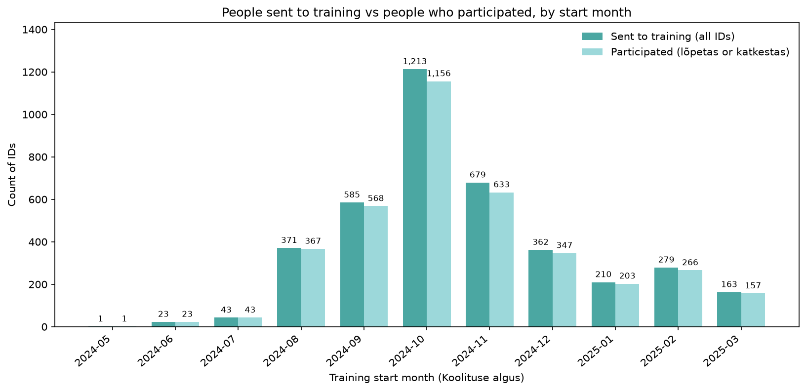
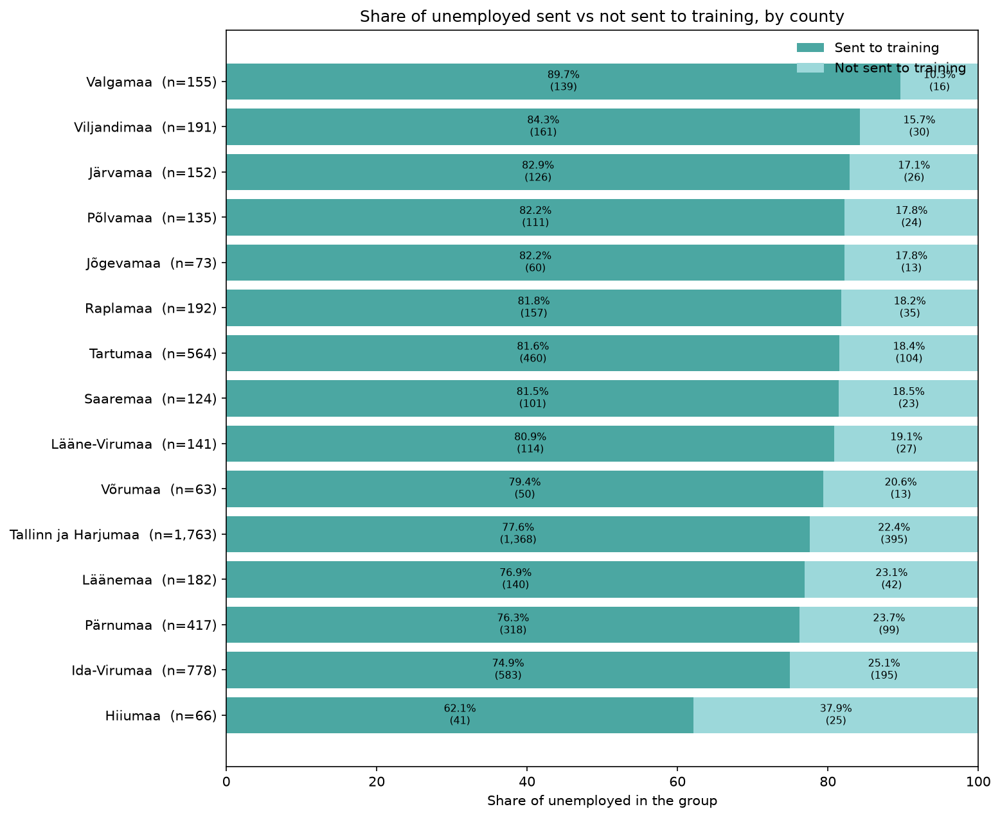
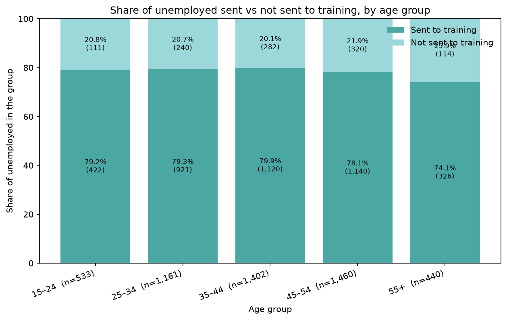
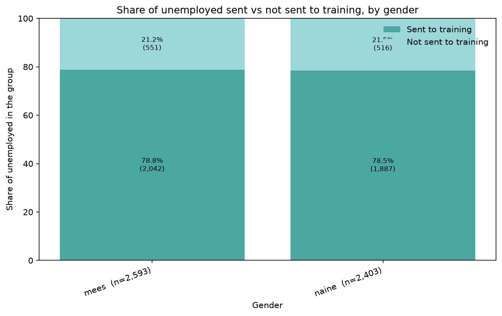
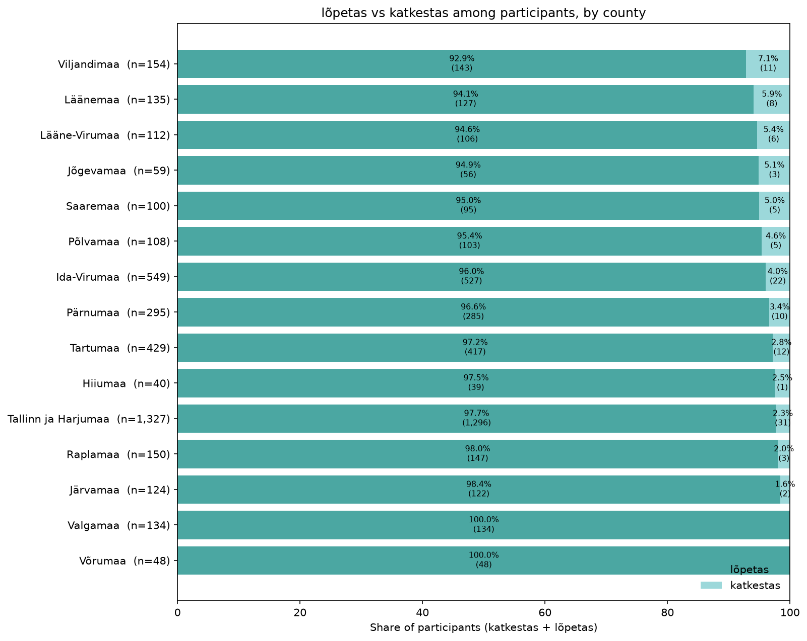
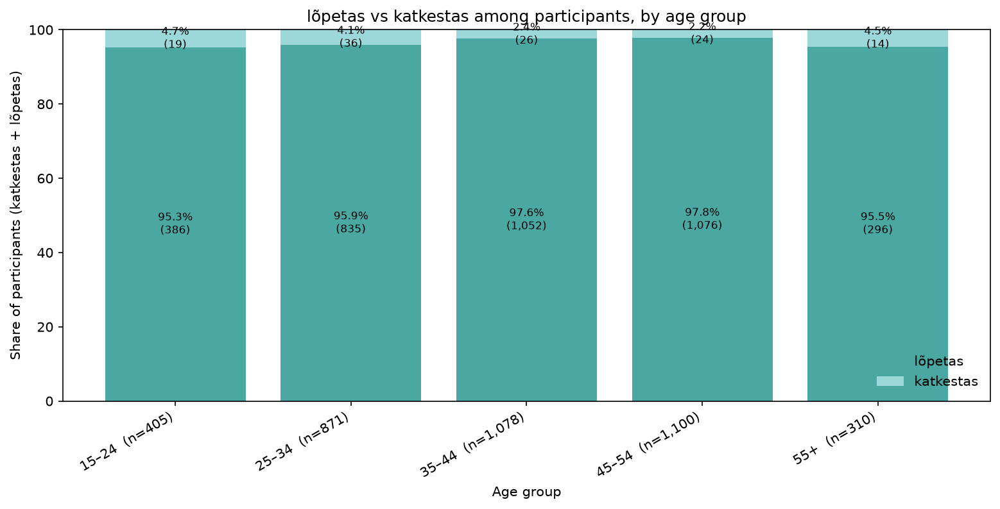
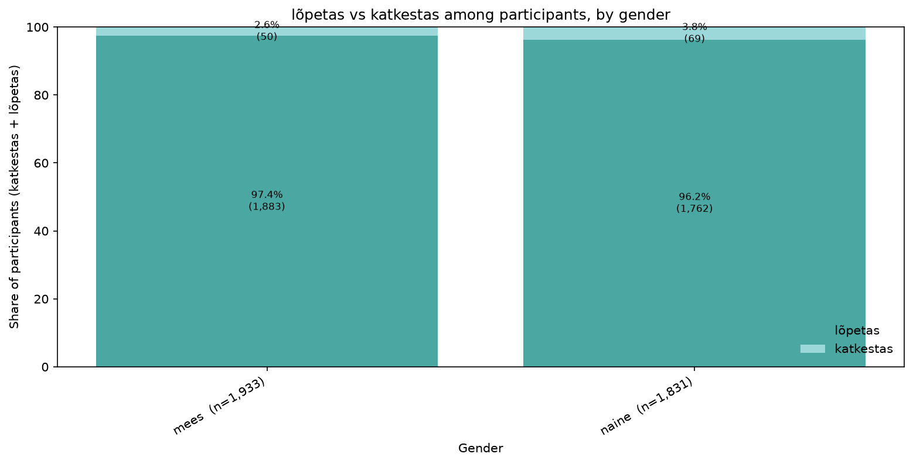
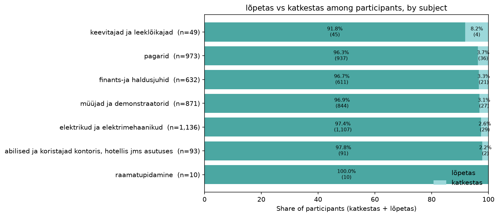
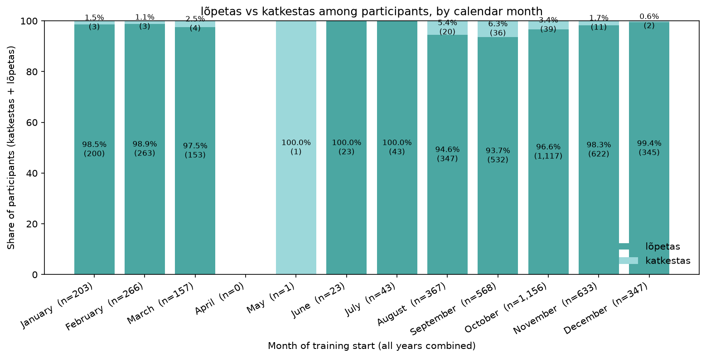

# Exploratory analysis of unemployment and training data

This document records the analysis in the order it was done. Each section states what was computed, what it shows, and where the underlying files live.

Data are loaded with `src.load_data.load_raw_data()` from `data/raw`:

- **Unemployed persons** — `töötud.xls`
- **Trainings** — `koolitused.xls`

The two tables are analysed **separately** here. Code: `src/inspect/eda.py`. Run with `python -c "from src.inspect.eda import run_eda; run_eda()"`.

---

## 1. Data overview: shape, types, missing values, duplications

**What was done.** For each table, the script wrote shape, column types, missing-value counts and shares, duplicate rows, and duplicate `ID` values. Date pairs were checked so that an end date is never before the start date.

Full text: [output/txt/overview.txt](output/txt/overview.txt)

### Unemployed persons (`töötud.xls`)

4,996 rows × 6 columns. Types match the intended meaning of each field: `ID` and `Vanus` are integers, `Sugu` and `Maakond` are text, `Töötuse algus` and `Töötuse lõpp` are dates.

| Check | Result |
| --- | --- |
| Duplicate rows | 0 |
| Duplicate IDs | 0 (4,996 unique IDs, range 1–5,000) |
| Missing values | only `Töötuse lõpp`: **2,947 (59.0%)** |
| End before start | 0 of 2,049 completed spells |

**Conclusion.** The unemployed table is one row per person. The only missingness is unemployment end date, so **59% of spells are still open** (right-censored) at the time of the extract. IDs have gaps (max 5,000 with 4,996 rows), which is a coding range, not a data-quality failure.

### Trainings (`koolitused.xls`)

3,930 rows × 6 columns. `ID` is integer; start and end of training are dates; occupation, result, and training card are text.

| Check | Result |
| --- | --- |
| Duplicate rows | 0 |
| Duplicate IDs | 0 (3,930 unique IDs, range 1–5,000) |
| Missing values | **none** |
| End before start | 0 |
| End equal to start | **393 (10.0%)** |

**Conclusion.** The training table is complete and one row per training ID. One in ten courses starts and ends on the same calendar day; those are counted as **1 day**, not 0. Training IDs also sit in 1–5,000 and are fewer than unemployed persons, so not every unemployed person has a training row.

---

## 2. Descriptive statistics

**What was done.** For every original variable, and for spell/course duration in days, the script wrote count, sum, average, mean, median, standard deviation, and IQR where those quantities are meaningful. Identifiers and categoricals are summarised with counts and frequencies instead of means.

Full text: [output/txt/descriptives.txt](output/txt/descriptives.txt)

Numeric summaries used below are copied from that file. Categorical value counts are in the same file.

---

## 3. Unemployed persons — variables

### 3.1 Identifier (`ID`)

4,996 unique values from 1 to 5,000. Sum, mean, and IQR are not used: `ID` only labels a person.

### 3.2 Sex (`Sugu`)

Almost even split: **2,593 men (51.9%)** and **2,403 women (48.1%)**. No missing values.

Other figure: [unemployed_sex_counts.png](output/png/eda/unemployed_sex_counts.png)

**Conclusion.** Sex is balanced enough that later comparisons by sex will not be driven by a tiny group.

### 3.3 Age (`Vanus`)

Age is the only original numeric measure on this table.

| Statistic | Value |
| --- | --- |
| Count | 4,996 |
| Mean / average | 39.75 years |
| Median | 40 years |
| Std | 10.88 |
| IQR | 18 (about 31 to 49) |
| Min–max | 15–61 |

**Conclusion.** Age is centred on 40 and roughly symmetric: mean and median agree, and the boxplot whiskers reach the observed min and max with **no Tukey outliers**. The working-age window 15–61 is plausible for an unemployment register. The histogram is jagged year-to-year rather than a smooth bell curve; that is expected with integer age and a few thousand people, not a data error.

### 3.4 County (`Maakond`)

15 counties, no missing values. The distribution is highly concentrated.

Tallinn ja Harjumaa alone is **1,763 people (35.3%)**. Together with Ida-Virumaa (15.6%), Tartumaa (11.3%), and Pärnumaa (8.3%) these four areas are about **70%** of the sample. The smallest counties (Võrumaa, Hiiumaa, Jõgevamaa) each have under 80 people.

**Conclusion.** Geography is skewed toward the capital region and a few larger counties. Any later rate-style comparison across counties needs care: small counties have little sample, and headcounts here are not population-adjusted.

### 3.5 Unemployment start and end dates

**Start (`Töötuse algus`)** is complete. Spells begin between **2017-10-17** and **2025-03-05**. The mean start is 2023-09-16; the median is later, **2024-04-19**. Standard deviation is 457 days and IQR is 935 days: start dates are spread over years, with a long left tail of older spells.

**End (`Töötuse lõpp`)** is observed for 2,049 people only. Those end dates sit in a **narrow window**: 2024-07-04 to 2025-03-26 (mean 2025-01-15, std only 44 days).

Figures:

- [unemployed_start_hist.png](output/png/eda/unemployed_start_hist.png)
- [unemployed_start_box.png](output/png/eda/unemployed_start_box.png)
- [unemployed_end_hist.png](output/png/eda/unemployed_end_hist.png)
- [unemployed_end_box.png](output/png/eda/unemployed_end_box.png)

**Conclusion.** This looks like a snapshot extract: everyone has a start date, but an end date appears only if the spell closed in the recent observation window. Open spells (59%) must be treated as censored, not as missing at random in the usual sense.

### 3.6 Unemployment duration (derived)

Duration in days is `Töötuse lõpp − Töötuse algus`, so it exists only for the 2,049 completed spells.

| Statistic | Value |
| --- | --- |
| Count | 2,049 |
| Mean | 479 days (~16 months) |
| Median | 286 days (~9.5 months) |
| Std | 426 |
| IQR | 824 |
| Min–max | 22–2,385 days |

Mean well above the median shows right skew and a heavy tail of long spells.

Boxplot: [unemployed_duration_box.png](output/png/eda/unemployed_duration_box.png)

**Conclusion.** Completed durations are **bimodal**, with a cluster under about 500 days and another around 1,000–1,700 days, and almost no mass in between. Combined with the narrow end-date window, duration largely reflects *when the spell started*. The gap is worth carrying into later work: it may be two entry cohorts, an administrative feature, or censoring of mid-length spells that are still open. Duration statistics **cannot** be read as typical length for everyone, because the 2,947 open spells are excluded.

---

## 4. Trainings — variables

### 4.1 Identifier (`ID`)

3,930 unique IDs from 1 to 5,000. Same caveat as above: not a numeric measure.

### 4.2 Training dates and duration

Starts run **2024-05-13** to **2025-03-24** (mean 2024-11-02, std 56 days). Ends run **2024-08-26** to **2025-09-13** (mean 2024-12-09). Training is a much tighter calendar window than unemployment.

Derived duration is inclusive of both dates: `(Koolituse lõpp − Koolituse algus).days + 1`. A course that starts and ends on the same day is 1 day.

| Statistic | Value |
| --- | --- |
| Count | 3,930 (no missing) |
| Mean | 37.3 days |
| Median | 24 days |
| Std | 38.2 |
| IQR | 59 |
| Min–max | 1–398 days |

Other figures:

- [trainings_duration_box.png](output/png/eda/trainings_duration_box.png)
- [trainings_start_hist.png](output/png/eda/trainings_start_hist.png)
- [trainings_start_box.png](output/png/eda/trainings_start_box.png)

**Conclusion.** Most courses are short: the histogram piles up near 1–15 days, then a smaller group around one to four months, and a long tail to 398 days. **10% last 1 day** (start = end). Median 24 vs mean 37.3 confirms right skew. Unlike unemployment, every training has both dates, so duration is not censored here.

### 4.3 Occupation (`Koolituse ametiala`)

Seven occupations. Four dominate:

| Occupation | n | Share |
| --- | --- | --- |
| elektrikud ja elektrimehaanikud | 1,183 | 30.1% |
| pagarid | 1,027 | 26.1% |
| müüjad ja demonstraatorid | 903 | 23.0% |
| finants-ja haldusjuhid | 657 | 16.7% |
| abilised ja koristajad … | 97 | 2.5% |
| keevitajad ja leeklõikajad | 51 | 1.3% |
| raaamatupidamine | 12 | 0.3% |

**Conclusion.** Electricians, bakers, and sales roles are the main programmes. Accounting (`raaamatupidamine`, 12 rows) is too small for stable subgroup estimates. The triple-a in `raaamatupidamine` and the missing space in `finants-ja haldusjuhid` look like source typos, not extra categories.

### 4.4 Result (`Koolituse tulemus`)

**92.8% finished (`lõpetas`, 3,646).** Withdrawal (`loobus`, 3.3%) and interruption (`katkestas`, 3.0%) are small. Cancelled (`jäi ära`, 0.7%) and refused (`keeldus`, 0.3%) are rare.

**Conclusion.** Outcome is heavily imbalanced. A model or rate for “did not finish” would be predicting a ~7% event. The five labels are distinct and complete (no missing).

### 4.5 Training card (`Koolituskaart`)

**ei** 2,546 (64.8%), **jah** 1,384 (35.2%). The raw file had a trailing space on `ei`; the loader strips it, so only these two values remain.

Figure: [trainings_card_counts.png](output/png/eda/trainings_card_counts.png)

**Conclusion.** About one third of trainings are flagged with a training card. The variable is usable as a binary indicator.

---

## 5. Findings to carry forward

1. **Two clean person-level tables**, no duplicate IDs or duplicate rows. Join key is `ID`; coverage will be incomplete (3,930 trainings vs 4,996 unemployed).
2. **Unemployment end date is the only missing field** and it means the spell is still open (59%). Duration for completed spells is biased if used as “typical unemployment length”.
3. **Completed unemployment duration is bimodal** and end dates are bunched in late 2024–early 2025. Treat duration as a snapshot of closed spells, not a full survival picture.
4. **Age is well-behaved** (15–61, median 40, no boxplot outliers). Sex is balanced. County is dominated by Tallinn ja Harjumaa.
5. **Trainings are short, recent, and usually completed.** Same-day courses (10%) count as 1 day. The occupation typo `raaamatupidamine` should be kept in mind in later steps.
6. Sum/mean/IQR were **not applied** to IDs or categoricals; they are reported in [descriptives.txt](output/txt/descriptives.txt) only where they are meaningful.

---

## 6. Value labels on figures

**What was done.** All PNGs in [output/png/eda](output/png/eda) were regenerated with numbers on the chart. Exploratory figures are kept in this subfolder so later plots can go in other folders under `output/png`.

- Bar charts show **count and share** on each bar (for example `1,763 (35.3%)`).
- Histograms show **bin counts** on the bars, plus n / mean / median in a corner box.
- Boxplots show **n, min, Q1, median, Q3, max** in a corner box (dates as `YYYY-MM-DD`).

**Conclusion.** The pictures in the sections above can be read without going back to the text files for the main frequencies and quartiles. The underlying numbers are unchanged.

---

## 7. Inclusive training duration (end − start + 1)

**What was done.** Training length was first computed as calendar difference only (`end − start`), which made same-day courses 0 days and pulled the average down by 1. Duration is now **inclusive of both dates**:

`(Koolituse lõpp − Koolituse algus).days + 1`

Unemployment duration is unchanged (`end − start` for completed spells only).

Updated summaries: [output/txt/descriptives.txt](output/txt/descriptives.txt), [output/txt/overview.txt](output/txt/overview.txt). Duration figures in [output/png/eda](output/png/eda) were regenerated.

| Statistic | Exclusive (old) | Inclusive (current) |
| --- | --- | --- |
| Mean / average | 36.3 days | **37.3 days** |
| Median | 23 | **24** |
| Std | 38.2 | 38.2 |
| IQR | 59 | 59 |
| Min–max | 0–397 | **1–398** |
| Same-day courses (n=393, 10%) | 0 days | **1 day** |

**Conclusion.** Adding one day to every training shifts location statistics by 1 and leaves spread (std, IQR) the same. The average training duration is **37.3 days**. Same-day start and end is a 1-day course, not a zero-length one.

---

## 8. Monthly starts: sent to training vs participated

**What was done.** From `koolitused.xls`, each person (`ID`) was assigned to the **month of `Koolituse algus`**. For every month:

- **Sent to training** — count of all IDs that started that month.
- **Participated** — count of IDs whose `Koolituse tulemus` is `lõpetas` or `katkestas` only (`loobus`, `jäi ära`, and `keeldus` are sent but not counted as participated).

Code: `src/analysis/monthly_training.py`. Table: [output/txt/monthly_training.txt](output/txt/monthly_training.txt). Figure: [output/png/analysis/monthly_sent_vs_participated.png](output/png/analysis/monthly_sent_vs_participated.png).

| Month | Sent | Participated | Did not participate | Rate |
| --- | ---: | ---: | ---: | ---: |
| 2024-05 | 1 | 1 | 0 | 100.0% |
| 2024-06 | 23 | 23 | 0 | 100.0% |
| 2024-07 | 43 | 43 | 0 | 100.0% |
| 2024-08 | 371 | 367 | 4 | 98.9% |
| 2024-09 | 585 | 568 | 17 | 97.1% |
| 2024-10 | 1,213 | 1,156 | 57 | 95.3% |
| 2024-11 | 679 | 633 | 46 | 93.2% |
| 2024-12 | 362 | 347 | 15 | 95.9% |
| 2025-01 | 210 | 203 | 7 | 96.7% |
| 2025-02 | 279 | 266 | 13 | 95.3% |
| 2025-03 | 163 | 157 | 6 | 96.3% |
| **Total** | **3,929** | **3,764** | **165** | **95.8%** |

**Conclusion.** Starts run from May 2024 to March 2025, with a clear peak in **October 2024** (1,213 sent). Almost everyone who is sent also participates: **95.8%** overall (`lõpetas` or `katkestas`). The gap is small in every month (never more than 57 people) and is zero in the first three months, when volumes were tiny. Non-participation (`loobus`, `jäi ära`, `keeldus`) is 165 people (4.2%) and does not change the monthly shape: the sent and participated series move together.

---

## 9. Chart colours

**What was done.** All PNGs were redrawn with a two-colour palette: main **`#4ba7a2`**, secondary **`#9cd8da`**. Single-series bars and histograms use the main colour. Grouped bars use main for sent and secondary for participated. Boxplots use secondary fill and main outlines/median.

The numbers in the figures are unchanged. Folders: [output/png/eda](output/png/eda), [output/png/analysis](output/png/analysis).

---

## 10. Share sent vs not sent to training (among all unemployed)

**What was done.** Each unemployed person (`töötud.xls`) was classified by whether their `ID` appears in `koolitused.xls`:

- **Sent to training** — unemployed ID is in the training table
- **Not sent to training** — unemployed ID is not in the training table

Shares use **all unemployed IDs** as the denominator. The split was then computed separately by **county (`Maakond`)**, **age group**, and **gender (`Sugu`)**. Age groups are 15–24, 25–34, 35–44, 45–54, and 55+ (data range is 15–61).

Code: `src/analysis/sent_share.py`. Table: [output/txt/sent_share.txt](output/txt/sent_share.txt).

Overall: **3,929 of 4,996 unemployed were sent (78.6%)**; **1,067 were not (21.4%)**. Every training ID is also in the unemployed table (0 training-only IDs).

### County

Sent share is **highest in Valgamaa (89.7%)** and **lowest in Hiiumaa (62.1%)**. Most counties sit between about 75% and 85%. The two largest groups are near or a bit below the national 78.6%: Tallinn ja Harjumaa 77.6% (n=1,763) and Ida-Virumaa 74.9% (n=778). Hiiumaa’s low share is based on only 66 people, so it should not be over-read.

### Age group

Sent share is almost flat from 15 to 54 (about **78–80%**). It drops for **55+ to 74.1%** (326 of 440). Age does not strongly sort who is sent, except a modest gap at the oldest group.

### Gender

Men **78.8%** (2,042 of 2,593) and women **78.5%** (1,887 of 2,403). Gender does not distinguish sent vs not sent.

**Conclusion.** About **four in five** unemployed people in this extract were sent to training. The remaining fifth is not a gender gap and not mainly an age gap. County differences are larger: Valgamaa vs Hiiumaa is about 28 percentage points, while the big counties (Harjumaa, Ida-Virumaa) are close to the overall rate. Later work that compares outcomes of “training” vs “no training” should treat county as a relevant split and gender as balanced.

Figures: [output/png/analysis](output/png/analysis). Table: [output/txt/sent_share.txt](output/txt/sent_share.txt).

---

## 11. Completion vs dropout among participants (`lõpetas` and `katkestas`)

**What was done.** The sample is people who **participated**: `Koolituse tulemus` is `lõpetas` or `katkestas` only (`loobus`, `jäi ära`, `keeldus` are excluded). For that group the script counted:

- all participant IDs (`katkestas` + `lõpetas`)
- count of `katkestas`
- count of `lõpetas`
- share of each from `katkestas + lõpetas`

This was done separately by **county**, **age group** (same bands as section 10), **gender**, **subject (`Koolituse ametiala`)**, and **calendar month** of `Koolituse algus` (January–December across years, not year-month). County, age, and gender come from joining training IDs to `töötud.xls`.

Code: `src/analysis/completion_share.py`. Table: [output/txt/completion_share.txt](output/txt/completion_share.txt).

Overall: **3,764 participants** — **3,645 lõpetas (96.8%)** and **119 katkestas (3.2%)**. Dropout is rare.

### County

Dropout is highest in **Viljandimaa (7.1%)** and **Läänemaa (5.9%)**. **Valgamaa** and **Võrumaa** have no dropouts (n=134 and 48). Tallinn ja Harjumaa is 2.3% (31 of 1,327). County dropout rates stay in a narrow band; most of the 119 dropouts are in the large counties by volume, not by rate.

### Age group

Dropout is a bit higher at the ends of the age range: **15–24 (4.7%)** and **55+ (4.5%)**, and lowest at **45–54 (2.2%)** and **35–44 (2.4%)**. The gap is a few percentage points, not a different process.

### Gender

Women **3.8%** katkestas (69 of 1,831) vs men **2.6%** (50 of 1,933). A small difference; both groups finish at 96%+.

### Subject

**Welders (`keevitajad ja leeklõikajad`) have the highest dropout (8.2%)**, but n=49. Bakers 3.7% (36 of 973 — the most dropouts in count). Accounting (`raamatupidamine`) is 10 people, all finished. The large programmes (electricians, bakers, sales) all sit near 96–97% lõpetas.

### Calendar month

Month is the start month with years pooled (January 2025 with January 2024, and so on). **April has no starts.** **May is one person** who dropped out — that 100% is not a seasonal fact. Dropout is slightly higher in **September (6.3%)** and **August (5.4%)**, when volumes are already large. October has the most participants (1,156) and 3.4% dropout. Winter months (Nov–Feb) are 1–2% dropout.

**Conclusion.** Among people who actually take part, **almost everyone finishes (96.8%)**. `katkestas` is a 3.2% event. It is a little more common for welders, Viljandimaa, younger and older participants, women, and late-summer starts — but no split turns dropout into a large share. Volume of dropouts follows volume of participants (October), not the highest rates. May and tiny subjects should not drive the story.

Figures: [output/png/analysis](output/png/analysis). Table: [output/txt/completion_share.txt](output/txt/completion_share.txt).
