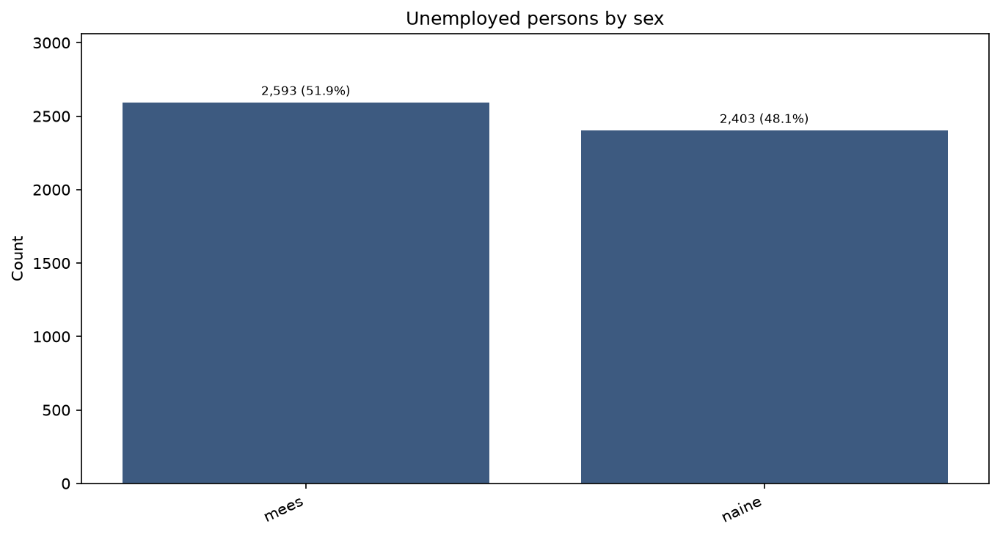
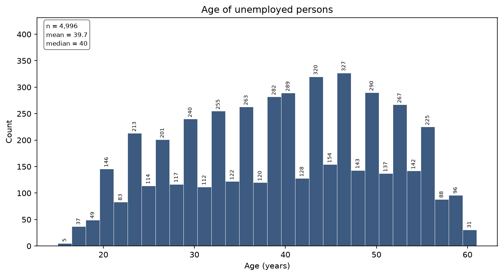
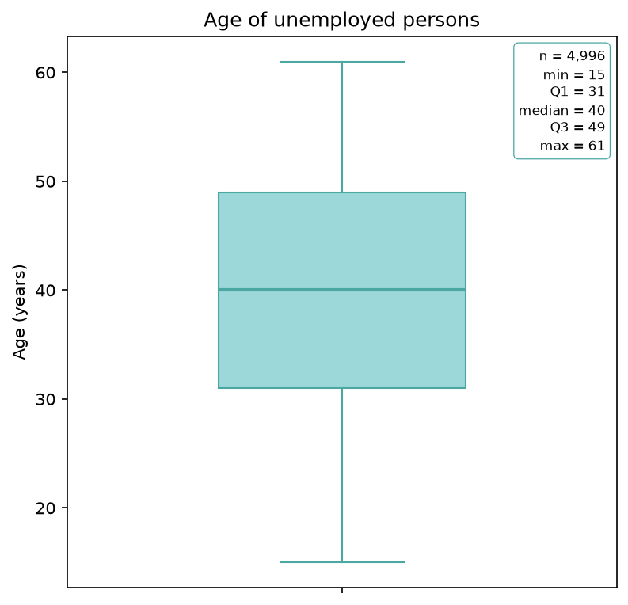
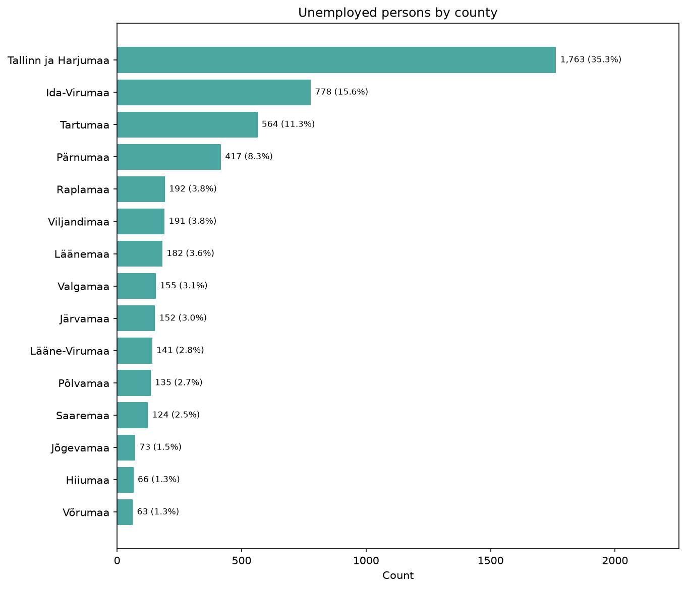
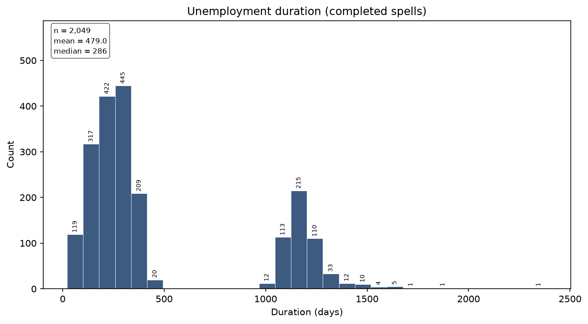
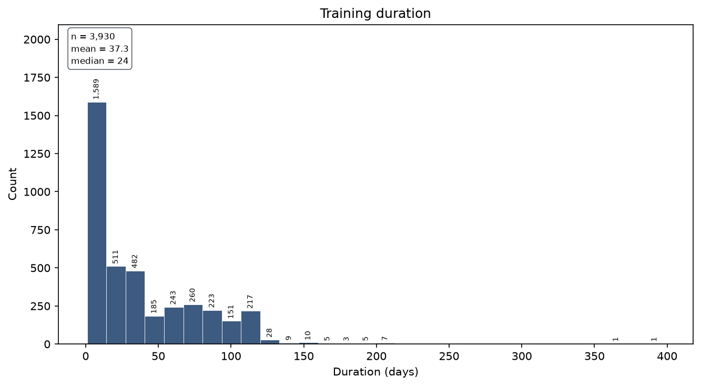
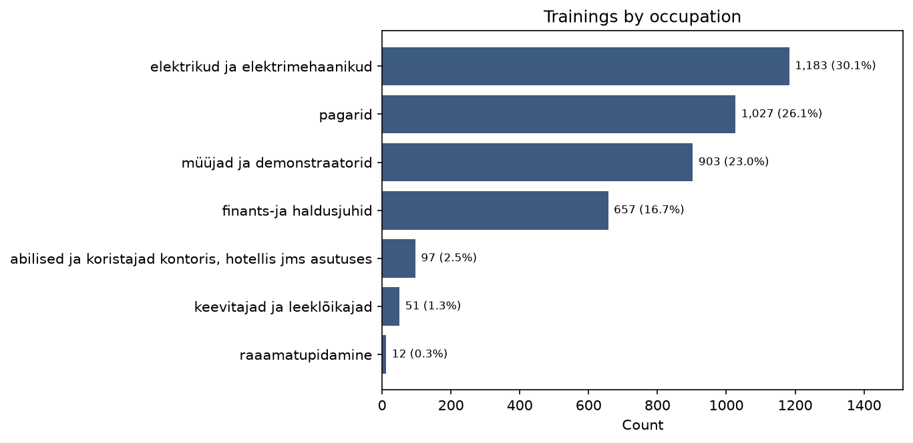
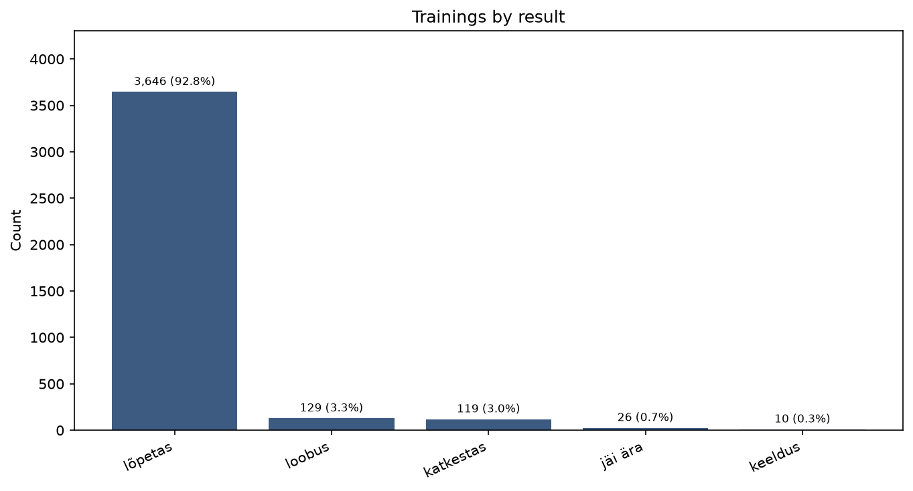

# Exploratory analysis of unemployment and training data

This document records the analysis in the order it was done. Each section states what was computed, what it shows, and where the underlying files live.

Data are loaded with `src.load_data.load_raw_data()` from `data/raw`:

- **Unemployed persons** — `töötud.xls`
- **Trainings** — `koolitused.xls`

The two tables are analysed **separately** here. Code: `src/inspect/eda.py`. Run with `python -c "from src.inspect.eda import run_eda; run_eda()"`.

---

## 1. Data overview: shape, types, missing values, duplications

**What was done.** For each table, the script wrote shape, column types, missing-value counts and shares, duplicate rows, and duplicate `ID` values. Date pairs were checked so that an end date is never before the start date.

Full text: [output/txt/overview.txt](output/txt/overview.txt)

### Unemployed persons (`töötud.xls`)

4,996 rows × 6 columns. Types match the intended meaning of each field: `ID` and `Vanus` are integers, `Sugu` and `Maakond` are text, `Töötuse algus` and `Töötuse lõpp` are dates.

| Check | Result |
| --- | --- |
| Duplicate rows | 0 |
| Duplicate IDs | 0 (4,996 unique IDs, range 1–5,000) |
| Missing values | only `Töötuse lõpp`: **2,947 (59.0%)** |
| End before start | 0 of 2,049 completed spells |

**Conclusion.** The unemployed table is one row per person. The only missingness is unemployment end date, so **59% of spells are still open** (right-censored) at the time of the extract. IDs have gaps (max 5,000 with 4,996 rows), which is a coding range, not a data-quality failure.

### Trainings (`koolitused.xls`)

3,930 rows × 6 columns. `ID` is integer; start and end of training are dates; occupation, result, and training card are text.

| Check | Result |
| --- | --- |
| Duplicate rows | 0 |
| Duplicate IDs | 0 (3,930 unique IDs, range 1–5,000) |
| Missing values | **none** |
| End before start | 0 |
| End equal to start | **393 (10.0%)** |

**Conclusion.** The training table is complete and one row per training ID. One in ten courses starts and ends on the same calendar day; those are counted as **1 day**, not 0. Training IDs also sit in 1–5,000 and are fewer than unemployed persons, so not every unemployed person has a training row.

---

## 2. Descriptive statistics

**What was done.** For every original variable, and for spell/course duration in days, the script wrote count, sum, average, mean, median, standard deviation, and IQR where those quantities are meaningful. Identifiers and categoricals are summarised with counts and frequencies instead of means.

Full text: [output/txt/descriptives.txt](output/txt/descriptives.txt)

Numeric summaries used below are copied from that file. Categorical value counts are in the same file.

---

## 3. Unemployed persons — variables

### 3.1 Identifier (`ID`)

4,996 unique values from 1 to 5,000. Sum, mean, and IQR are not used: `ID` only labels a person.

### 3.2 Sex (`Sugu`)

Almost even split: **2,593 men (51.9%)** and **2,403 women (48.1%)**. No missing values.

Other figure: [unemployed_sex_counts.png](output/png/eda/unemployed_sex_counts.png)

**Conclusion.** Sex is balanced enough that later comparisons by sex will not be driven by a tiny group.

### 3.3 Age (`Vanus`)

Age is the only original numeric measure on this table.

| Statistic | Value |
| --- | --- |
| Count | 4,996 |
| Mean / average | 39.75 years |
| Median | 40 years |
| Std | 10.88 |
| IQR | 18 (about 31 to 49) |
| Min–max | 15–61 |

**Conclusion.** Age is centred on 40 and roughly symmetric: mean and median agree, and the boxplot whiskers reach the observed min and max with **no Tukey outliers**. The working-age window 15–61 is plausible for an unemployment register. The histogram is jagged year-to-year rather than a smooth bell curve; that is expected with integer age and a few thousand people, not a data error.

### 3.4 County (`Maakond`)

15 counties, no missing values. The distribution is highly concentrated.

Tallinn ja Harjumaa alone is **1,763 people (35.3%)**. Together with Ida-Virumaa (15.6%), Tartumaa (11.3%), and Pärnumaa (8.3%) these four areas are about **70%** of the sample. The smallest counties (Võrumaa, Hiiumaa, Jõgevamaa) each have under 80 people.

**Conclusion.** Geography is skewed toward the capital region and a few larger counties. Any later rate-style comparison across counties needs care: small counties have little sample, and headcounts here are not population-adjusted.

### 3.5 Unemployment start and end dates

**Start (`Töötuse algus`)** is complete. Spells begin between **2017-10-17** and **2025-03-05**. The mean start is 2023-09-16; the median is later, **2024-04-19**. Standard deviation is 457 days and IQR is 935 days: start dates are spread over years, with a long left tail of older spells.

**End (`Töötuse lõpp`)** is observed for 2,049 people only. Those end dates sit in a **narrow window**: 2024-07-04 to 2025-03-26 (mean 2025-01-15, std only 44 days).

Figures:

- [unemployed_start_hist.png](output/png/eda/unemployed_start_hist.png)
- [unemployed_start_box.png](output/png/eda/unemployed_start_box.png)
- [unemployed_end_hist.png](output/png/eda/unemployed_end_hist.png)
- [unemployed_end_box.png](output/png/eda/unemployed_end_box.png)

**Conclusion.** This looks like a snapshot extract: everyone has a start date, but an end date appears only if the spell closed in the recent observation window. Open spells (59%) must be treated as censored, not as missing at random in the usual sense.

### 3.6 Unemployment duration (derived)

Duration in days is `Töötuse lõpp − Töötuse algus`, so it exists only for the 2,049 completed spells.

| Statistic | Value |
| --- | --- |
| Count | 2,049 |
| Mean | 479 days (~16 months) |
| Median | 286 days (~9.5 months) |
| Std | 426 |
| IQR | 824 |
| Min–max | 22–2,385 days |

Mean well above the median shows right skew and a heavy tail of long spells.

Boxplot: [unemployed_duration_box.png](output/png/eda/unemployed_duration_box.png)

**Conclusion.** Completed durations are **bimodal**, with a cluster under about 500 days and another around 1,000–1,700 days, and almost no mass in between. Combined with the narrow end-date window, duration largely reflects *when the spell started*. The gap is worth carrying into later work: it may be two entry cohorts, an administrative feature, or censoring of mid-length spells that are still open. Duration statistics **cannot** be read as typical length for everyone, because the 2,947 open spells are excluded.

---

## 4. Trainings — variables

### 4.1 Identifier (`ID`)

3,930 unique IDs from 1 to 5,000. Same caveat as above: not a numeric measure.

### 4.2 Training dates and duration

Starts run **2024-05-13** to **2025-03-24** (mean 2024-11-02, std 56 days). Ends run **2024-08-26** to **2025-09-13** (mean 2024-12-09). Training is a much tighter calendar window than unemployment.

Derived duration is inclusive of both dates: `(Koolituse lõpp − Koolituse algus).days + 1`. A course that starts and ends on the same day is 1 day.

| Statistic | Value |
| --- | --- |
| Count | 3,930 (no missing) |
| Mean | 37.3 days |
| Median | 24 days |
| Std | 38.2 |
| IQR | 59 |
| Min–max | 1–398 days |

Other figures:

- [trainings_duration_box.png](output/png/eda/trainings_duration_box.png)
- [trainings_start_hist.png](output/png/eda/trainings_start_hist.png)
- [trainings_start_box.png](output/png/eda/trainings_start_box.png)

**Conclusion.** Most courses are short: the histogram piles up near 1–15 days, then a smaller group around one to four months, and a long tail to 398 days. **10% last 1 day** (start = end). Median 24 vs mean 37.3 confirms right skew. Unlike unemployment, every training has both dates, so duration is not censored here.

### 4.3 Occupation (`Koolituse ametiala`)

Seven occupations. Four dominate:

| Occupation | n | Share |
| --- | --- | --- |
| elektrikud ja elektrimehaanikud | 1,183 | 30.1% |
| pagarid | 1,027 | 26.1% |
| müüjad ja demonstraatorid | 903 | 23.0% |
| finants-ja haldusjuhid | 657 | 16.7% |
| abilised ja koristajad … | 97 | 2.5% |
| keevitajad ja leeklõikajad | 51 | 1.3% |
| raaamatupidamine | 12 | 0.3% |

**Conclusion.** Electricians, bakers, and sales roles are the main programmes. Accounting (`raaamatupidamine`, 12 rows) is too small for stable subgroup estimates. The triple-a in `raaamatupidamine` and the missing space in `finants-ja haldusjuhid` look like source typos, not extra categories.

### 4.4 Result (`Koolituse tulemus`)

**92.8% finished (`lõpetas`, 3,646).** Withdrawal (`loobus`, 3.3%) and interruption (`katkestas`, 3.0%) are small. Cancelled (`jäi ära`, 0.7%) and refused (`keeldus`, 0.3%) are rare.

**Conclusion.** Outcome is heavily imbalanced. A model or rate for “did not finish” would be predicting a ~7% event. The five labels are distinct and complete (no missing).

### 4.5 Training card (`Koolituskaart`)

**ei** 2,546 (64.8%), **jah** 1,384 (35.2%). The raw file had a trailing space on `ei`; the loader strips it, so only these two values remain.

Figure: [trainings_card_counts.png](output/png/eda/trainings_card_counts.png)

**Conclusion.** About one third of trainings are flagged with a training card. The variable is usable as a binary indicator.

---

## 5. Findings to carry forward

1. **Two clean person-level tables**, no duplicate IDs or duplicate rows. Join key is `ID`; coverage will be incomplete (3,930 trainings vs 4,996 unemployed).
2. **Unemployment end date is the only missing field** and it means the spell is still open (59%). Duration for completed spells is biased if used as “typical unemployment length”.
3. **Completed unemployment duration is bimodal** and end dates are bunched in late 2024–early 2025. Treat duration as a snapshot of closed spells, not a full survival picture.
4. **Age is well-behaved** (15–61, median 40, no boxplot outliers). Sex is balanced. County is dominated by Tallinn ja Harjumaa.
5. **Trainings are short, recent, and usually completed.** Same-day courses (10%) count as 1 day. The occupation typo `raaamatupidamine` should be kept in mind in later steps.
6. Sum/mean/IQR were **not applied** to IDs or categoricals; they are reported in [descriptives.txt](output/txt/descriptives.txt) only where they are meaningful.

---

## 6. Value labels on figures

**What was done.** All PNGs in [output/png/eda](output/png/eda) were regenerated with numbers on the chart. Exploratory figures are kept in this subfolder so later plots can go in other folders under `output/png`.

- Bar charts show **count and share** on each bar (for example `1,763 (35.3%)`).
- Histograms show **bin counts** on the bars, plus n / mean / median in a corner box.
- Boxplots show **n, min, Q1, median, Q3, max** in a corner box (dates as `YYYY-MM-DD`).

**Conclusion.** The pictures in the sections above can be read without going back to the text files for the main frequencies and quartiles. The underlying numbers are unchanged.

---

## 7. Inclusive training duration (end − start + 1)

**What was done.** Training length was first computed as calendar difference only (`end − start`), which made same-day courses 0 days and pulled the average down by 1. Duration is now **inclusive of both dates**:

`(Koolituse lõpp − Koolituse algus).days + 1`

Unemployment duration is unchanged (`end − start` for completed spells only).

Updated summaries: [output/txt/descriptives.txt](output/txt/descriptives.txt), [output/txt/overview.txt](output/txt/overview.txt). Duration figures in [output/png/eda](output/png/eda) were regenerated.

| Statistic | Exclusive (old) | Inclusive (current) |
| --- | --- | --- |
| Mean / average | 36.3 days | **37.3 days** |
| Median | 23 | **24** |
| Std | 38.2 | 38.2 |
| IQR | 59 | 59 |
| Min–max | 0–397 | **1–398** |
| Same-day courses (n=393, 10%) | 0 days | **1 day** |

**Conclusion.** Adding one day to every training shifts location statistics by 1 and leaves spread (std, IQR) the same. The average training duration is **37.3 days**. Same-day start and end is a 1-day course, not a zero-length one.

All figures: [output/png/eda](output/png/eda). All text summaries: [output/txt](output/txt).
