# Analysis of unemployment and training data

This document records the analysis in the order it was done. Each section states what was computed, what it shows, and where the underlying files live.

Data are loaded with `src.load_data.load_raw_data()` from `data/raw`:

- **Unemployed persons** — `töötud.xls`
- **Trainings** — `koolitused.xls`

The two tables are analysed **separately** here. Code: `src/inspect/eda.py`. Run with `python -c "from src.inspect.eda import run_eda; run_eda()"`.

---

## 1. Data overview: shape, types, missing values, duplications

**What was done.** For each table, the script wrote shape, column types, missing-value counts and shares, duplicate rows, and duplicate `ID` values. Date pairs were checked so that an end date is never before the start date.

Full text: [output/txt/overview.txt](output/txt/overview.txt)

### Unemployed persons (`töötud.xls`)

4,996 rows × 6 columns. Types match the intended meaning of each field: `ID` and `Vanus` are integers, `Sugu` and `Maakond` are text, `Töötuse algus` and `Töötuse lõpp` are dates.

| Check | Result |
| --- | --- |
| Duplicate rows | 0 |
| Duplicate IDs | 0 (4,996 unique IDs, range 1–5,000) |
| Missing values | only `Töötuse lõpp`: **2,947 (59.0%)** |
| End before start | 0 of 2,049 completed spells |

**Conclusion.** The unemployed table is one row per person. The only missingness is unemployment end date, so **59% of spells are still open** (right-censored) at the time of the extract. IDs have gaps (max 5,000 with 4,996 rows), which is a coding range, not a data-quality failure.

### Trainings (`koolitused.xls`)

3,930 rows × 6 columns. `ID` is integer; start and end of training are dates; occupation, result, and training card are text.

| Check | Result |
| --- | --- |
| Duplicate rows | 0 |
| Duplicate IDs | 0 (3,930 unique IDs, range 1–5,000) |
| Missing values | **none** |
| End before start | 0 |
| End equal to start | **393 (10.0%)** |

**Conclusion.** The training table is complete and one row per training ID. One in ten courses starts and ends on the same calendar day; those are counted as **1 day**, not 0. Training IDs also sit in 1–5,000 and are fewer than unemployed persons, so not every unemployed person has a training row.

---

## 2. Descriptive statistics

**What was done.** For every original variable, and for spell/course duration in days, the script wrote count, sum, average, mean, median, standard deviation, and IQR where those quantities are meaningful. Identifiers and categoricals are summarised with counts and frequencies instead of means.

Full text: [output/txt/descriptives.txt](output/txt/descriptives.txt)

Numeric summaries used below are copied from that file. Categorical value counts are in the same file.

---

## 3. Unemployed persons — variables

### 3.1 Identifier (`ID`)

4,996 unique values from 1 to 5,000. Sum, mean, and IQR are not used: `ID` only labels a person.

### 3.2 Sex (`Sugu`)

Almost even split: **2,593 men (51.9%)** and **2,403 women (48.1%)**. No missing values.

Other figure: [unemployed_sex_counts.png](output/png/eda/unemployed_sex_counts.png)

**Conclusion.** Sex is balanced enough that later comparisons by sex will not be driven by a tiny group.

### 3.3 Age (`Vanus`)

Age is the only original numeric measure on this table.

| Statistic | Value |
| --- | --- |
| Count | 4,996 |
| Mean / average | 39.75 years |
| Median | 40 years |
| Std | 10.88 |
| IQR | 18 (about 31 to 49) |
| Min–max | 15–61 |

**Conclusion.** Age is centred on 40 and roughly symmetric: mean and median agree, and the boxplot whiskers reach the observed min and max with **no Tukey outliers**. The working-age window 15–61 is plausible for an unemployment register. The histogram is jagged year-to-year rather than a smooth bell curve; that is expected with integer age and a few thousand people, not a data error.

### 3.4 County (`Maakond`)

15 counties, no missing values. The distribution is highly concentrated.

Tallinn ja Harjumaa alone is **1,763 people (35.3%)**. Together with Ida-Virumaa (15.6%), Tartumaa (11.3%), and Pärnumaa (8.3%) these four areas are about **70%** of the sample. The smallest counties (Võrumaa, Hiiumaa, Jõgevamaa) each have under 80 people.

**Conclusion.** Geography is skewed toward the capital region and a few larger counties. Any later rate-style comparison across counties needs care: small counties have little sample, and headcounts here are not population-adjusted.

### 3.5 Unemployment start and end dates

**Start (`Töötuse algus`)** is complete. Spells begin between **2017-10-17** and **2025-03-05**. The mean start is 2023-09-16; the median is later, **2024-04-19**. Standard deviation is 457 days and IQR is 935 days: start dates are spread over years, with a long left tail of older spells.

**End (`Töötuse lõpp`)** is observed for 2,049 people only. Those end dates sit in a **narrow window**: 2024-07-04 to 2025-03-26 (mean 2025-01-15, std only 44 days).

Figures:

- [unemployed_start_hist.png](output/png/eda/unemployed_start_hist.png)
- [unemployed_start_box.png](output/png/eda/unemployed_start_box.png)
- [unemployed_end_hist.png](output/png/eda/unemployed_end_hist.png)
- [unemployed_end_box.png](output/png/eda/unemployed_end_box.png)

**Conclusion.** This looks like a snapshot extract: everyone has a start date, but an end date appears only if the spell closed in the recent observation window. Open spells (59%) must be treated as censored, not as missing at random in the usual sense.

### 3.6 Unemployment duration (derived)

Duration in days is `Töötuse lõpp − Töötuse algus`, so it exists only for the 2,049 completed spells.

| Statistic | Value |
| --- | --- |
| Count | 2,049 |
| Mean | 479 days (~16 months) |
| Median | 286 days (~9.5 months) |
| Std | 426 |
| IQR | 824 |
| Min–max | 22–2,385 days |

Mean well above the median shows right skew and a heavy tail of long spells.

Boxplot: [unemployed_duration_box.png](output/png/eda/unemployed_duration_box.png)

**Conclusion.** Completed durations are **bimodal**, with a cluster under about 500 days and another around 1,000–1,700 days, and almost no mass in between. Combined with the narrow end-date window, duration largely reflects *when the spell started*. The gap is worth carrying into later work: it may be two entry cohorts, an administrative feature, or censoring of mid-length spells that are still open. Duration statistics **cannot** be read as typical length for everyone, because the 2,947 open spells are excluded.

---

## 4. Trainings — variables

### 4.1 Identifier (`ID`)

3,930 unique IDs from 1 to 5,000. Same caveat as above: not a numeric measure.

### 4.2 Training dates and duration

Starts run **2024-05-13** to **2025-03-24** (mean 2024-11-02, std 56 days). Ends run **2024-08-26** to **2025-09-13** (mean 2024-12-09). Training is a much tighter calendar window than unemployment.

Derived duration is inclusive of both dates: `(Koolituse lõpp − Koolituse algus).days + 1`. A course that starts and ends on the same day is 1 day.

| Statistic | Value |
| --- | --- |
| Count | 3,930 (no missing) |
| Mean | 37.3 days |
| Median | 24 days |
| Std | 38.2 |
| IQR | 59 |
| Min–max | 1–398 days |

Other figures:

- [trainings_duration_box.png](output/png/eda/trainings_duration_box.png)
- [trainings_start_hist.png](output/png/eda/trainings_start_hist.png)
- [trainings_start_box.png](output/png/eda/trainings_start_box.png)

**Conclusion.** Most courses are short: the histogram piles up near 1–15 days, then a smaller group around one to four months, and a long tail to 398 days. **10% last 1 day** (start = end). Median 24 vs mean 37.3 confirms right skew. Unlike unemployment, every training has both dates, so duration is not censored here.

### 4.3 Occupation (`Koolituse ametiala`)

Seven occupations. Four dominate:

| Occupation | n | Share |
| --- | --- | --- |
| elektrikud ja elektrimehaanikud | 1,183 | 30.1% |
| pagarid | 1,027 | 26.1% |
| müüjad ja demonstraatorid | 903 | 23.0% |
| finants-ja haldusjuhid | 657 | 16.7% |
| abilised ja koristajad … | 97 | 2.5% |
| keevitajad ja leeklõikajad | 51 | 1.3% |
| raamatupidamine | 12 | 0.3% |

**Conclusion.** Electricians, bakers, and sales roles are the main programmes. Accounting (`raamatupidamine`, 12 rows) is too small for stable subgroup estimates.

### 4.4 Result (`Koolituse tulemus`)

**92.8% finished (`lõpetas`, 3,646).** Withdrawal (`loobus`, 3.3%) and interruption (`katkestas`, 3.0%) are small. Cancelled (`jäi ära`, 0.7%) and refused (`keeldus`, 0.3%) are rare.

**Conclusion.** Outcome is heavily imbalanced. A model or rate for “did not finish” would be predicting a ~7% event. The five labels are distinct and complete (no missing).

### 4.5 Training card (`Koolituskaart`)

**ei** 2,546 (64.8%), **jah** 1,384 (35.2%). The raw file had a trailing space on `ei`; the loader strips it, so only these two values remain.

Figure: [trainings_card_counts.png](output/png/eda/trainings_card_counts.png)

**Conclusion.** About one third of trainings are flagged with a training card. The variable is usable as a binary indicator.

---

## 5. Findings to carry forward

1. **Two clean person-level tables**, no duplicate IDs or duplicate rows. Join key is `ID`; coverage will be incomplete (3,930 trainings vs 4,996 unemployed).
2. **Unemployment end date is the only missing field** and it means the spell is still open (59%). Duration for completed spells is biased if used as “typical unemployment length”.
3. **Completed unemployment duration is bimodal** and end dates are bunched in late 2024–early 2025. Treat duration as a snapshot of closed spells, not a full survival picture.
4. **Age is well-behaved** (15–61, median 40, no boxplot outliers). Sex is balanced. County is dominated by Tallinn ja Harjumaa.
5. **Trainings are short, recent, and usually completed.** Same-day courses (10%) count as 1 day.

---

## 6. Value labels on figures

**What was done.** All PNGs in [output/png/eda](output/png/eda) were regenerated with numbers on the chart. Exploratory figures are kept in this subfolder so later plots can go in other folders under `output/png`.

- Bar charts show **count and share** on each bar (for example `1,763 (35.3%)`).
- Histograms show **bin counts** on the bars, plus n / mean / median in a corner box.
- Boxplots show **n, min, Q1, median, Q3, max** in a corner box (dates as `YYYY-MM-DD`).

**Conclusion.** The pictures in the sections above can be read without going back to the text files for the main frequencies and quartiles. The underlying numbers are unchanged.

---

## 7. Inclusive training duration (end − start + 1)

**What was done.** Training length was first computed as calendar difference only (`end − start`), which made same-day courses 0 days and pulled the average down by 1. Duration is now **inclusive of both dates**:

`(Koolituse lõpp − Koolituse algus).days + 1`

Summaries: [output/txt/descriptives.txt](output/txt/descriptives.txt), [output/txt/overview.txt](output/txt/overview.txt). Duration figures [output/png/eda](output/png/eda).

---

## 8. Monthly starts: sent to training vs participated

**What was done.** From `koolitused.xls`, each person (`ID`) was assigned to the **month of `Koolituse algus`**. For every month:

- **Sent to training** — count of all IDs that started that month.
- **Participated** — count of IDs whose `Koolituse tulemus` is `lõpetas` or `katkestas` only (`loobus`, `jäi ära`, and `keeldus` are sent but not counted as participated).

Code: `src/analysis/monthly_training.py`. Table: [output/txt/monthly_training.txt](output/txt/monthly_training.txt). Figure: [output/png/analysis/monthly_sent_vs_participated.png](output/png/analysis/monthly_sent_vs_participated.png).

| Month | Sent | Participated | Did not participate | Rate |
| --- | ---: | ---: | ---: | ---: |
| 2024-05 | 1 | 1 | 0 | 100.0% |
| 2024-06 | 23 | 23 | 0 | 100.0% |
| 2024-07 | 43 | 43 | 0 | 100.0% |
| 2024-08 | 371 | 367 | 4 | 98.9% |
| 2024-09 | 585 | 568 | 17 | 97.1% |
| 2024-10 | 1,213 | 1,156 | 57 | 95.3% |
| 2024-11 | 679 | 633 | 46 | 93.2% |
| 2024-12 | 362 | 347 | 15 | 95.9% |
| 2025-01 | 210 | 203 | 7 | 96.7% |
| 2025-02 | 279 | 266 | 13 | 95.3% |
| 2025-03 | 163 | 157 | 6 | 96.3% |
| **Total** | **3,929** | **3,764** | **165** | **95.8%** |

**Conclusion.** Starts run from May 2024 to March 2025, with a clear peak in **October 2024** (1,213 sent). Almost everyone who is sent also participates: **95.8%** overall (`lõpetas` or `katkestas`). The gap is small in every month (never more than 57 people) and is zero in the first three months, when volumes were tiny. Non-participation (`loobus`, `jäi ära`, `keeldus`) is 165 people (4.2%) and does not change the monthly shape: the sent and participated series move together.

---

## 9. Chart colours

**What was done.** All PNGs were redrawn with a two-colour palette: main **`#4ba7a2`**, secondary **`#9cd8da`**. Single-series bars and histograms use the main colour. Grouped bars use main for sent and secondary for participated. Boxplots use secondary fill and main outlines/median.

The numbers in the figures are unchanged. Folders: [output/png/eda](output/png/eda), [output/png/analysis](output/png/analysis).

---

## 10. Share sent vs not sent to training (among all unemployed)

**What was done.** Each unemployed person (`töötud.xls`) was classified by whether their `ID` appears in `koolitused.xls`:

- **Sent to training** — unemployed ID is in the training table
- **Not sent to training** — unemployed ID is not in the training table

Shares use **all unemployed IDs** as the denominator. The split was then computed separately by **county (`Maakond`)**, **age group**, and **gender (`Sugu`)**. Age groups are 15–24, 25–34, 35–44, 45–54, and 55+ (data range is 15–61).

Code: `src/analysis/sent_share.py`. Table: [output/txt/sent_share.txt](output/txt/sent_share.txt).

Overall: **3,929 of 4,996 unemployed were sent (78.6%)**; **1,067 were not (21.4%)**. Every training ID is also in the unemployed table (0 training-only IDs).

### County

Sent share is **highest in Valgamaa (89.7%)** and **lowest in Hiiumaa (62.1%)**. Most counties sit between about 75% and 85%. The two largest groups are near or a bit below the national 78.6%: Tallinn ja Harjumaa 77.6% (n=1,763) and Ida-Virumaa 74.9% (n=778). Hiiumaa’s low share is based on only 66 people, so it should not be over-read.

### Age group

Sent share is almost flat from 15 to 54 (about **78–80%**). It drops for **55+ to 74.1%** (326 of 440). Age does not strongly sort who is sent, except a modest gap at the oldest group.

### Gender

Men **78.8%** (2,042 of 2,593) and women **78.5%** (1,887 of 2,403). Gender does not distinguish sent vs not sent.

**Conclusion.** About **four in five** unemployed people in this extract were sent to training. The remaining fifth is not a gender gap and not mainly an age gap. County differences are larger: Valgamaa vs Hiiumaa is about 28 percentage points, while the big counties (Harjumaa, Ida-Virumaa) are close to the overall rate. Later work that compares outcomes of “training” vs “no training” should treat county as a relevant split and gender as balanced.

Figures: [output/png/analysis](output/png/analysis). Table: [output/txt/sent_share.txt](output/txt/sent_share.txt).

---

## 11. Completion vs dropout among participants (`lõpetas` and `katkestas`)

**What was done.** The sample is people who **participated**: `Koolituse tulemus` is `lõpetas` or `katkestas` only (`loobus`, `jäi ära`, `keeldus` are excluded). For that group the script counted:

- all participant IDs (`katkestas` + `lõpetas`)
- count of `katkestas`
- count of `lõpetas`
- share of each from `katkestas + lõpetas`

This was done separately by **county**, **age group** (same bands as section 10), **gender**, **subject (`Koolituse ametiala`)**, and **calendar month** of `Koolituse algus` (January–December across years, not year-month). County, age, and gender come from joining training IDs to `töötud.xls`.

Code: `src/analysis/completion_share.py`. Table: [output/txt/completion_share.txt](output/txt/completion_share.txt).

Overall: **3,764 participants** — **3,645 lõpetas (96.8%)** and **119 katkestas (3.2%)**. Dropout is rare.

### County

Dropout is highest in **Viljandimaa (7.1%)** and **Läänemaa (5.9%)**. **Valgamaa** and **Võrumaa** have no dropouts (n=134 and 48). Tallinn ja Harjumaa is 2.3% (31 of 1,327). County dropout rates stay in a narrow band; most of the 119 dropouts are in the large counties by volume, not by rate.

### Age group

Dropout is a bit higher at the ends of the age range: **15–24 (4.7%)** and **55+ (4.5%)**, and lowest at **45–54 (2.2%)** and **35–44 (2.4%)**. The gap is a few percentage points, not a different process.

### Gender

Women **3.8%** katkestas (69 of 1,831) vs men **2.6%** (50 of 1,933). A small difference; both groups finish at 96%+.

### Subject

**Welders (`keevitajad ja leeklõikajad`) have the highest dropout (8.2%)**, but n=49. Bakers 3.7% (36 of 973 — the most dropouts in count). Accounting (`raamatupidamine`) is 10 people, all finished. The large programmes (electricians, bakers, sales) all sit near 96–97% lõpetas.

### Calendar month

Month is the start month with years pooled (January 2025 with January 2024, and so on). **April has no starts.** **May is one person** who dropped out — that 100% is not a seasonal fact. Dropout is slightly higher in **September (6.3%)** and **August (5.4%)**, when volumes are already large. October has the most participants (1,156) and 3.4% dropout. Winter months (Nov–Feb) are 1–2% dropout.

**Conclusion.** Among people who actually take part, **almost everyone finishes (96.8%)**. `katkestas` is a 3.2% event. It is a little more common for welders, Viljandimaa, younger and older participants, women, and late-summer starts — but no split turns dropout into a large share. Volume of dropouts follows volume of participants (October), not the highest rates. May and tiny subjects should not drive the story.

Figures: [output/png/analysis](output/png/analysis). Table: [output/txt/completion_share.txt](output/txt/completion_share.txt).

---

## 12. Patterns, interactions, and differences

**What was done.** After the one-way splits, the joined tables were used to look for interactions: unemployment-start year, wait from unemployment to training, one-day course records vs result, whether the spell is still open vs sent to training, sent share by **age × gender**, training card vs result, and result mix by gender.

Code: `src/analysis/insights.py`. Table: [output/txt/insights.txt](output/txt/insights.txt).

### Two entry cohorts, not a smooth time series

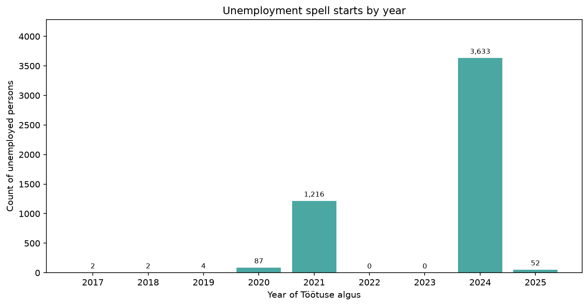

There are **no unemployment starts in 2022 or 2023**. Starts cluster in **2021 (1,216)** and **2024 (3,633)**, with a thin tail in 2017–2020 and 52 starts in early 2025. That empty two-year gap is the same hole seen earlier in completed-spell duration (section 3.6). The extract is two stacked cohorts, not a continuous inflow.

### Wait to training is the same two cohorts

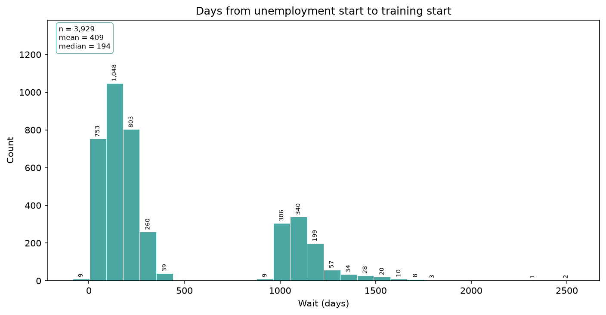

Among 3,929 people sent to training, wait (`Koolituse algus − Töötuse algus`) has mean **409 days** and median **194**. The histogram is bimodal:

| Cohort of `Töötuse algus` | n | Median wait | Mean wait |
| --- | ---: | ---: | ---: |
| 2017–2021 | 1,017 | **1,093 days** (~3 years) | 1,138 |
| 2024–2025 | 2,912 | **146 days** (~5 months) | 154 |

Almost nobody waits 366–500 days (29 people). The long waits are 2021 (and earlier) spells whose training only starts in 2024–2025. Timing errors are rare: **4** trainings begin before unemployment, **8** after the spell already ended.

**Conclusion.** “Long wait to training” is mostly **when the spell started**, not a separate queue process. Do not treat wait as a continuous policy lever without splitting these cohorts.

### One-day records explain withdrawal, cancel, and refuse

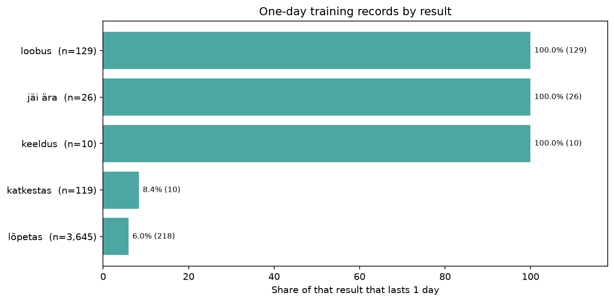

All **393** same-day courses (section 4.2) line up with result:

| Result | n | 1-day share |
| --- | ---: | ---: |
| loobus | 129 | **100%** |
| jäi ära | 26 | **100%** |
| keeldus | 10 | **100%** |
| katkestas | 119 | 8.4% |
| lõpetas | 3,645 | 6.0% |

`loobus`, `jäi ära`, and `keeldus` never have a multi-day duration. They look like **administrative one-day placeholders**, not short courses. Most `katkestas` and `lõpetas` rows are real multi-day trainings (median 34 and 26 days). About 218 `lõpetas` rows are also 1-day — those can be genuine one-day completions.

**Conclusion.** Compare finish vs dropout only on `lõpetas` + `katkestas` (as section 11 did). Do not fold `loobus` / `jäi ära` / `keeldus` into a “failed training” rate; they did not run as a course in the dates.

### Training is not tied to whether the spell has closed

**59.0%** of people who were sent still have an open spell, and **59.0%** of people who were not sent also do. In this snapshot, being sent to training does **not** mark who has already left unemployment. Exit dates remain bunched in the recent window (section 3.5); they are not an outcome of training in these files.

### Gender gap appears only at age 55+

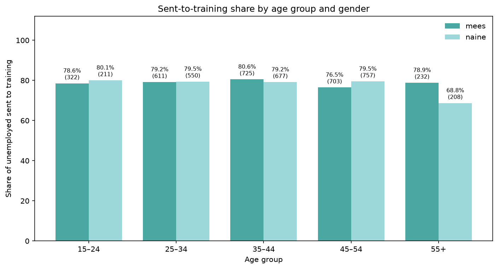

Overall sent share is the same for men and women (section 10). Crossed with age:

| Age | Men sent | Women sent |
| --- | ---: | ---: |
| 15–24 | 78.6% (253/322) | 80.1% (169/211) |
| 25–34 | 79.2% (484/611) | 79.5% (437/550) |
| 35–44 | 80.6% (584/725) | 79.2% (536/677) |
| 45–54 | 76.5% (538/703) | 79.5% (602/757) |
| **55+** | **78.9% (183/232)** | **68.8% (143/208)** |

The only clear interaction is **women 55+**: about **10 points** below men of the same age and below every younger group. Sample is 208 women, large enough to take seriously, small enough that county mix can still move the rate.

Among those who *are* sent, men withdraw more (`loobus` 4.1% vs 2.4%) and women interrupt more (`katkestas` 3.7% vs 2.4%). Finish rates stay 92–93%.

### Training card and result

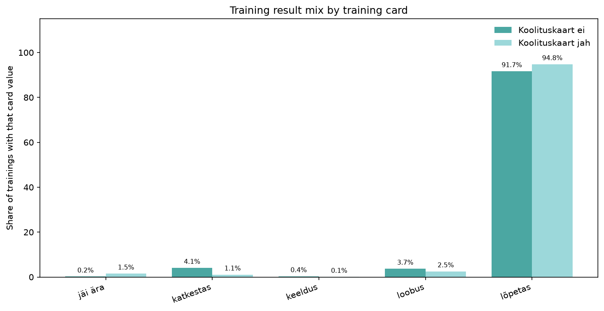

With a card (`jah`, n=1,384): **lõpetas 94.8%**, `katkestas` only 1.1%, but `jäi ära` 1.5%. Without a card (`ei`, n=2,545): **lõpetas 91.7%**, `katkestas` 4.1%, `loobus` 3.7%. The card group finishes a bit more often and drops out less; cancelled courses (`jäi ära`) are more common with a card. This is association, not proof that the card causes completion.

---

## 13. Not sent vs participated: unemployment length and end

**What was done.** People **not sent** (ID only in `töötud.xls`) were compared with people who **participated** (`Koolituse tulemus` is `lõpetas` or `katkestas`). Two clocks:

- **Unemployment length** — `Töötuse lõpp − Töötuse algus` in calendar days, only if the spell has ended
- **After training start** — `Töötuse lõpp − Koolituse algus` in calendar days (participants with an end date only; not-sent people have no training start)

Share of spells that have an end date is the measure of “unemployment ended” in this extract. Code: `src/analysis/duration_impact.py`. Table: [output/txt/duration_impact.txt](output/txt/duration_impact.txt).

| Group | n | Spell ended | Still open | Median UE days (ended) | Mean UE days | Median days from training start to UE end |
| --- | ---: | ---: | ---: | ---: | ---: | ---: |
| Not sent | 1,067 | **438 (41.0%)** | 629 | **298** | 514 | — (no `Koolituse algus`) |
| Participated | 3,764 | **1,539 (40.9%)** | 2,225 | **285** | 466 | **91** (n=1,539; 7 ended before training) |

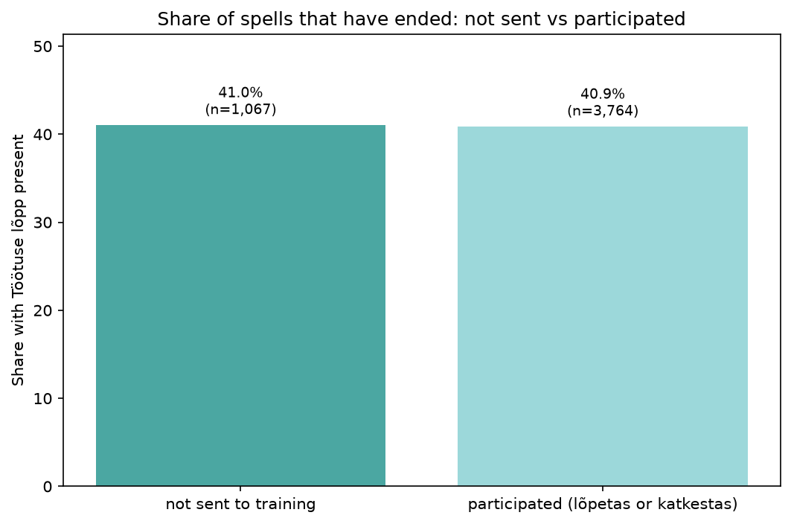

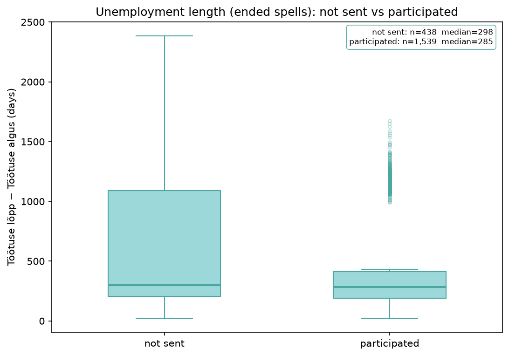

Histogram: [duration_ue_hist_notsent_vs_participated.png](output/png/analysis/duration_ue_hist_notsent_vs_participated.png). Days from training start to end (participants only): [duration_after_train_hist_participated.png](output/png/analysis/duration_after_train_hist_participated.png).

Among **ended** spells the medians are close (298 vs 285 days). The not-sent group has a longer right tail (mean 514, max 2,385, IQR 884 vs IQR 223). The **share that has ended is the same (41%)**. For participants who did leave, the median time from `Koolituse algus` to `Töötuse lõpp` is **91 days**.

Split by unemployment-start cohort (same hole as section 12):

| Cohort | Not sent ended | Participated ended | Median UE days (not sent / participated) |
| --- | ---: | ---: | ---: |
| 2017–2021 | 42.2% (n=294) | 38.1% (n=971) | 1,160 / 1,178 |
| 2024–2025 | 40.6% (n=773) | 41.9% (n=2,793) | 248 / 241 |

**Conclusion.** In this snapshot, **participating in training is not associated with a higher chance that the spell has ended**, and median length among ended spells differs by only about two weeks. The 2024–2025 cohort (most of the sample) is essentially identical. That does **not** show that training shortens unemployment: people who get a course have already waited (median 194 days, section 12), and end dates are still a narrow extract window. A later follow-up file would be needed for a real impact estimate.

---

## 14. `lõpetas` vs `katkestas`: unemployment length and end

**What was done.** The same two clocks as section 13, now only among participants, split by result.

| Group | n | Spell ended | Still open | Median UE days (ended) | Mean UE days | Median days from training start to UE end |
| --- | ---: | ---: | ---: | ---: | ---: | ---: |
| `lõpetas` | 3,645 | **1,465 (40.2%)** | 2,180 | **285** | 464 | **93** (6 ended before training) |
| `katkestas` | 119 | **74 (62.2%)** | 45 | **280.5** | 520 | **71** (1 ended before training) |

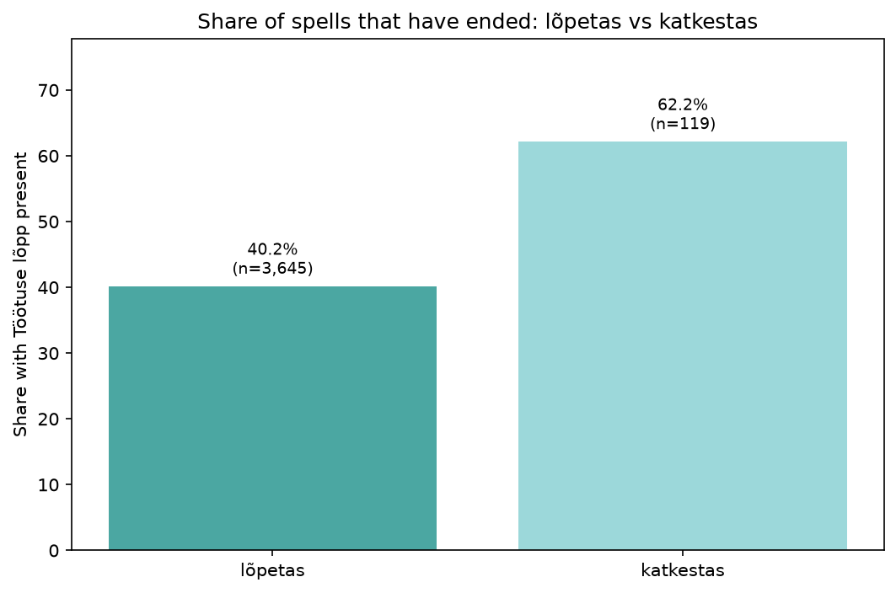

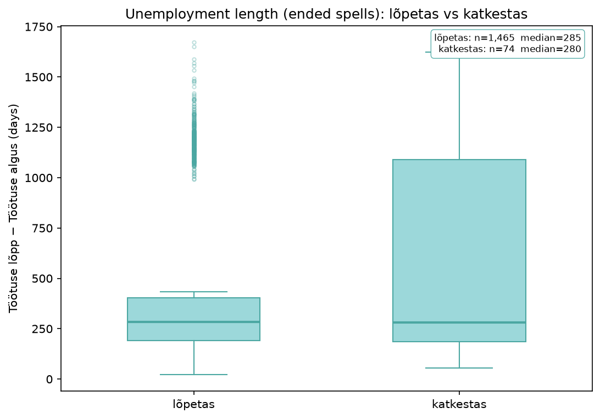

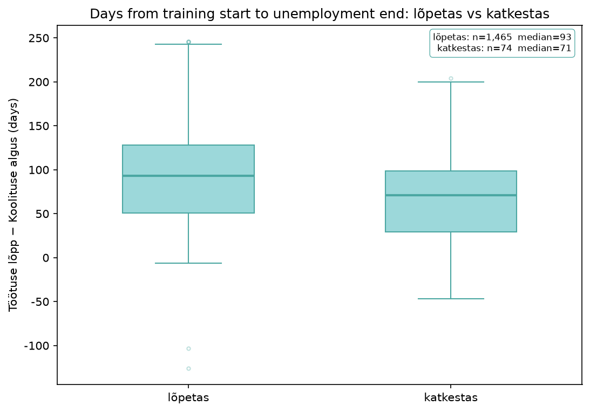

Other figures: [duration_ue_hist_lopetas_vs_katkestas.png](output/png/analysis/duration_ue_hist_lopetas_vs_katkestas.png), [duration_after_train_hist_lopetas_vs_katkestas.png](output/png/analysis/duration_after_train_hist_lopetas_vs_katkestas.png).

People who **interrupt** (`katkestas`) are much more likely to have already left the register (**62.2%** vs **40.2%**). Among those who left, **total** unemployment length is similar (median 285 vs 281 days), but time **after training starts** is shorter for `katkestas` (median **71** vs **93** days). The same gap in *share ended* appears in both cohorts (about 63–64% vs 37–41%).

**Conclusion.** Finishing the course does **not** line up with a shorter spell or a higher exit rate. The opposite pattern is more plausible as **selection**: people who interrupt are often already on the way out (or leave soon after the start date); people who finish are more often still unemployed when the extract is taken. This is not evidence that completing training lengthens unemployment, and not evidence that it shortens it. Sections 12 and 13 already show that `katkestas` is a small group (119 people) and that sent vs not sent have the same 41% exit rate.

Full table: [output/txt/duration_impact.txt](output/txt/duration_impact.txt).

---

## 15. Training status of unemployed people (not sent / not participated / participated)

**What was done.** Each unemployed person was put in one of three statuses:

- **Not sent** — `ID` is not in `koolitused.xls`
- **Not participated** — `Koolituse tulemus` is `jäi ära`, `keeldus`, or `loobus`
- **Participated** — `Koolituse tulemus` is `lõpetas` (osales in this file) or `katkestas`

Counts and shares use **all 4,996 unemployed IDs**. The same three-way split was then computed by **county (`Maakond`)**, **sex (`Sugu`)**, **age group**, **`Koolituse ametiala`**, and **`Koolituskaart`**. Row percentages are the mix of the three statuses inside each subgroup, so later faceted charts can use the same tables.

`Koolituse ametiala` and `Koolituskaart` exist only for people who were sent. People with no training row are kept as `(no training)` so the unemployed total still adds up.

Code: `src/analysis/training_status.py`. Readable tables and long-form CSVs (one pair per dimension):

- [training_status_overall.txt](output/txt/training_status_overall.txt) / [csv](output/txt/training_status_overall.csv)
- [training_status_by_county.txt](output/txt/training_status_by_county.txt) / [csv](output/txt/training_status_by_county.csv)
- [training_status_by_sex.txt](output/txt/training_status_by_sex.txt) / [csv](output/txt/training_status_by_sex.csv)
- [training_status_by_age.txt](output/txt/training_status_by_age.txt) / [csv](output/txt/training_status_by_age.csv)
- [training_status_by_ametiala.txt](output/txt/training_status_by_ametiala.txt) / [csv](output/txt/training_status_by_ametiala.csv)
- [training_status_by_koolituskaart.txt](output/txt/training_status_by_koolituskaart.txt) / [csv](output/txt/training_status_by_koolituskaart.csv)

### Overall

| Status | n | Share of unemployed |
| --- | ---: | ---: |
| Not sent | 1,067 | **21.4%** |
| Not participated | 165 | **3.3%** |
| Participated | 3,764 | **75.3%** |

Inside not participated: `loobus` 129 (78.2% of that group; 2.6% of all unemployed), `jäi ära` 26 (0.5%), `keeldus` 10 (0.2%). Inside participated: `lõpetas` 3,645 (73.0% of unemployed) and `katkestas` 119 (2.4%).

**Three in four** unemployed people took part. The leftover is almost all **not sent**, not people who were offered a course and then stayed out.

### County

| County | n | Not sent | Not participated | Participated |
| --- | ---: | ---: | ---: | ---: |
| Valgamaa | 155 | 10.3% | 3.2% | **86.5%** |
| Järvamaa | 152 | 17.1% | 1.3% | 81.6% |
| Tallinn ja Harjumaa | 1,763 | 22.4% | 2.3% | 75.3% |
| Tartumaa | 564 | 18.4% | **5.5%** | 76.1% |
| Pärnumaa | 417 | 23.7% | **5.5%** | 70.7% |
| Ida-Virumaa | 778 | 25.1% | 4.4% | 70.6% |
| Hiiumaa | 66 | **37.9%** | 1.5% | **60.6%** |

The spread in **participated** is about 26 points (Valgamaa vs Hiiumaa) and is driven by **not sent**, not by non-participation. Tartumaa and Pärnumaa have the highest non-participation among counties with volume (5.5%). Full county table: [training_status_by_county.txt](output/txt/training_status_by_county.txt).

### Sex

| Sex | n | Not sent | Not participated | Participated |
| --- | ---: | ---: | ---: | ---: |
| mees | 2,593 | 21.2% | **4.2%** | 74.5% |
| naine | 2,403 | 21.5% | 2.3% | **76.2%** |

Not-sent shares are the same. Men are more often in the non-start group (`loobus` / `jäi ära` / `keeldus`); women are slightly more often among those who actually take part.

### Age group

| Age | n | Not sent | Not participated | Participated |
| --- | ---: | ---: | ---: | ---: |
| 15–24 | 533 | 20.8% | 3.2% | 76.0% |
| 25–34 | 1,161 | 20.7% | 4.3% | 75.0% |
| 35–44 | 1,402 | 20.1% | 3.0% | **76.9%** |
| 45–54 | 1,460 | 21.9% | 2.7% | 75.3% |
| 55+ | 440 | **25.9%** | 3.6% | **70.5%** |

Ages 15–54 sit near 75–77% participated. **55+** is lower because more people are **not sent** (25.9%), not because they refuse or cancel more often.

### Occupation (`Koolituse ametiala`)

These rows are people who were sent to that occupation, so **not sent is 0**. `(no training)` is the 1,067 people with no training row.

| Occupation | n | Not participated | Participated |
| --- | ---: | ---: | ---: |
| elektrikud ja elektrimehaanikud | 1,183 | 4.0% | 96.0% |
| pagarid | 1,027 | **5.3%** | 94.7% |
| müüjad ja demonstraatorid | 903 | 3.5% | 96.5% |
| finants-ja haldusjuhid | 656 | 3.7% | 96.3% |
| abilised ja koristajad… | 97 | 4.1% | 95.9% |
| keevitajad ja leeklõikajad | 51 | 3.9% | 96.1% |
| raamatupidamine | 12 | 16.7% | 83.3% |

Among people who have an occupation assigned, **about 95–96% participate**. Bakers have the most non-starts in count (54). Accounting is 2 of 12 — too small to treat as a programme failure.

### Training card (`Koolituskaart`)

| Card | n | Not participated | Participated |
| --- | --- | ---: | ---: |
| `(no training)` | 1,067 | 0.0% | 0.0% (all not sent) |
| ei | 2,545 | 4.2% | 95.8% |
| jah | 1,384 | 4.1% | 95.9% |

Once someone is sent, **card vs no card does not change the take-up rate**. The card split is about who gets a course, not about who then starts it.

**Conclusion.** The unemployed population is **75.3% participated, 21.4% not sent, 3.3% not participated**. Access (being sent) is the large gap; non-start after a referral is a small slice and is mostly `loobus`. County and age 55+ move the **not-sent** share; sex moves **non-participation** (men higher). Occupation and training card barely move participation among those already sent. Section 16 draws the same three statuses as faceted charts.

---

## 16. Faceted comparison of the three training statuses

**What was done.** The section 15 tables were drawn as **small-multiple bar charts**. Each panel is one group. The three bars inside a panel are **not sent**, **not participated**, and **participated**. Colour is fixed across every panel (not sent `#9cd8da`, not participated `#c47c5c`, participated `#4ba7a2`). The y-axis is **0–100%** on every panel. Panels are **sorted by not-sent share**, highest first. Dashed lines in each panel are the **overall shares of all unemployed**: not sent **21.4%**, not participated **3.3%**, participated **75.3%**.

The same structure was used for **county**, **sex**, and **age**. Two further figures keep county as the panel and put **sex** or **age** as bar clusters inside the panel. A separate script draws **age × sex**: age-group panels (same sort) with men and women as clusters inside each panel.

Code: `src/analysis/training_status_charts.py`, `src/analysis/training_status_age_sex.py`. Notes: [output/txt/training_status_facets.txt](output/txt/training_status_facets.txt). Cross-tab CSVs: [training_status_by_county_sex.csv](output/txt/training_status_by_county_sex.csv), [training_status_by_county_age.csv](output/txt/training_status_by_county_age.csv), [training_status_by_age_sex.csv](output/txt/training_status_by_age_sex.csv).

### County

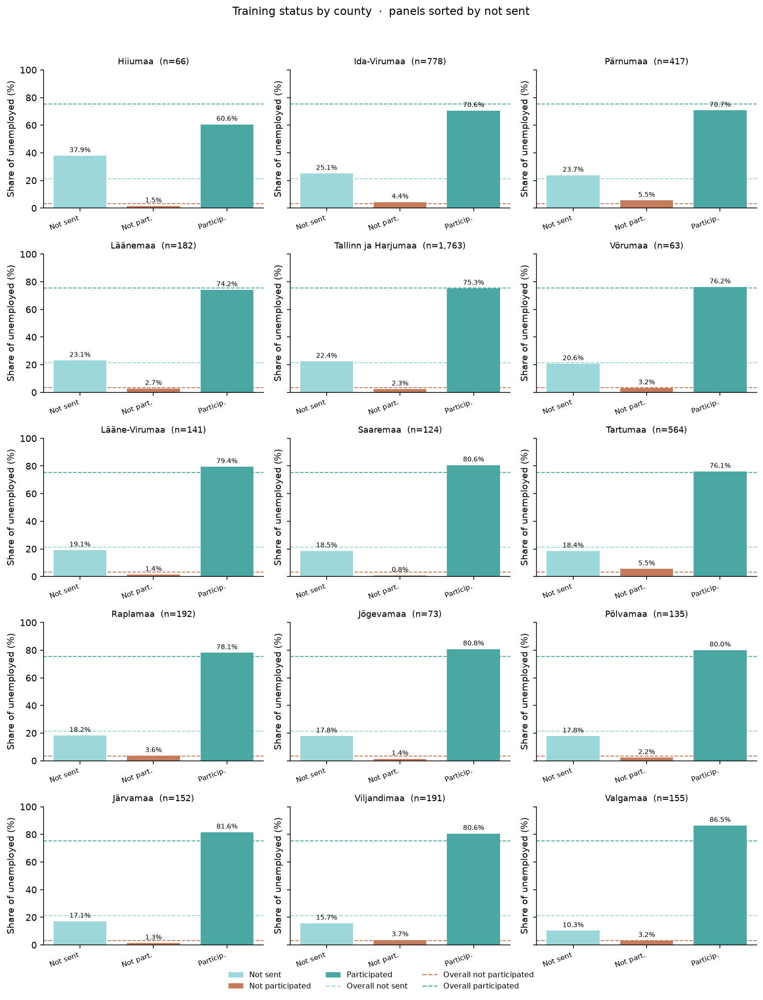

County order (not sent, high to low): **Hiiumaa 37.9%**, Ida-Virumaa 25.1%, Pärnumaa 23.7%, … down to **Valgamaa 10.3%**. Sorting on access puts the outlier first: Hiiumaa is well above the 21.4% not-sent line and well below the 75.3% participated line (60.6%). Valgamaa is the opposite (86.5% participated). Large counties sit near the overall lines (Tallinn ja Harjumaa 22.4% not sent). The brown not-participated bar stays small in every panel; Tartumaa and Pärnumaa still show the highest non-starts (5.5%) but they are no longer at the front.

### Sex

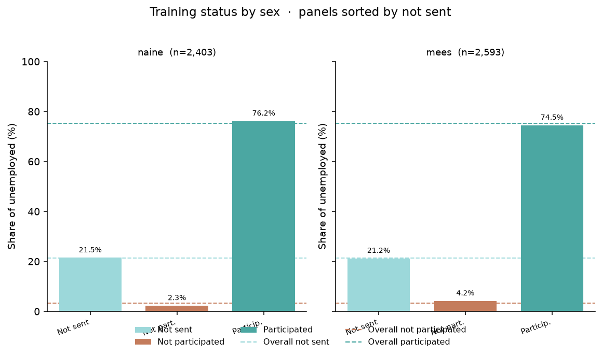

**Not sent** is on the overall line for both sexes (women **21.5%**, men **21.2%**), so sorting by not sent barely changes the order. **Not participated** is the split: men **4.2%** (above the 3.3% line), women **2.3%** (below it). Participated is the mirror of that (74.5% vs 76.2%).

### Age group

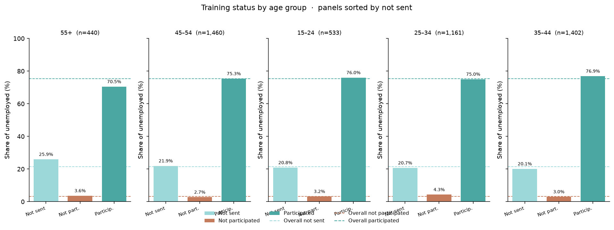

Sorted by not sent, **55+** is first (**25.9%** not sent, **70.5%** participated). Other ages sit on the overall mix (not sent 20–22%). Non-participation is not what moves age; access is.

### Age group and sex

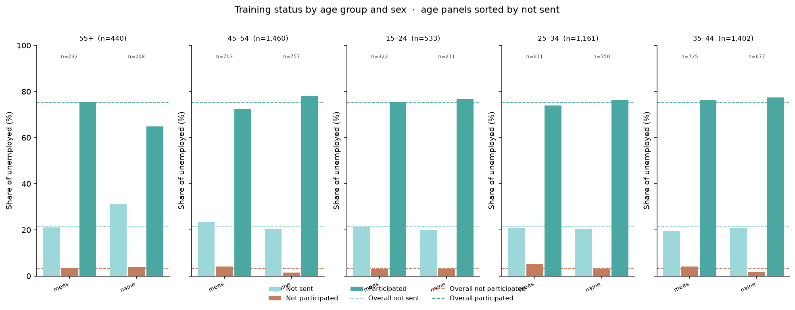

Table: [training_status_by_age_sex.txt](output/txt/training_status_by_age_sex.txt). Age panels keep the not-sent sort; inside each panel the clusters are **mees** and **naine**.

The only cell that clearly leaves the overall lines is **women 55+**: **31.2%** not sent (65 of 208) and **64.9%** participated. Men 55+ are on the national mix (21.1% not sent, 75.4% participated). Below 55, men and women have similar not-sent shares; men still have a slightly higher non-start rate (for example 25–34 men 5.2% vs women 3.3%). This is the same interaction as section 12, now in the three-status colours.

### Demographics within counties

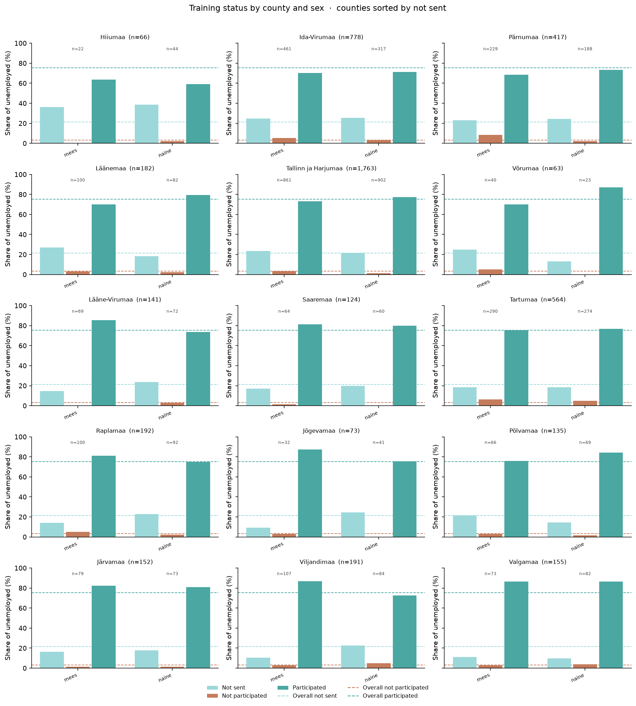

Counties follow the same not-sent order as the county figure. **Pärnumaa men** are **8.3%** not participated (19 of 229) vs **2.1%** of Pärnumaa women (4 of 188). Tartumaa men 6.2%, Ida-Virumaa men 5.2%. Hiiumaa’s high not-sent share is both sexes (36% men, 39% women).

Age within county: [training_status_facet_county_age.png](output/png/analysis/training_status_facet_county_age.png). Small counties have thin age cells (Hiiumaa n=66), so those bars move a lot. In larger counties the 55+ not-sent lift is visible but not a different story from the national age figure.

**Conclusion.** Sorting panels by **not sent** makes access the first thing the eye sees: Hiiumaa high, Valgamaa low, **women 55+** the only age–sex cell well above the 21.4% line. Participation still dominates every panel. Non-participation stays a thin bar except among some men (Pärnumaa, Tartumaa). Sex does not sort access except at 55+. Use the same colours and the same 0–100% scale when comparing any of these figures.

---

## 17. Summary of actionable insights

These points follow from sections 1–16. They are patterns in this extract, not causal effects of training on leaving unemployment.

1. **The register here is two cohorts.** Unemployment starts stop after 2021 and resume in 2024; 2022–2023 are empty. Duration, wait to training, and “long-term unemployed” all inherit that hole. Any trend over time must be split into 2017–2021 vs 2024–2025.

2. **Most people who are offered a course take it (95.8%) and finish it (96.8% of participants).** Among all unemployed the three-way split is **75.3% participated, 21.4% not sent, 3.3% not participated** (section 15). The scarce event is *not being sent*, not refusal or dropout. Targeting should focus on **who is left out**, not on a large non-start problem.

3. **The group left out is not “men vs women” in general.** Sent rates are flat by sex until **women aged 55+ (68.8% vs 78.9% for men 55+)**. That is the main demographic interaction worth a programme check (referral rules, health, occupation mix).

4. **County still matters for access.** Valgamaa 89.7% sent vs Hiiumaa 62.1%; large counties sit near 75–78%. Rates in tiny counties need care, but geography is a bigger access split than age 15–54 or gender overall.

5. **`loobus`, `jäi ära`, and `keeldus` are 100% one-day rows.** Treat them as non-starts, not as failed multi-day courses. `katkestas` is the real in-course dropout (~3%).

6. **Training card (`jah`) goes with slightly higher completion and lower `katkestas`.** It is a useful flag for later models, not by itself a recommendation to issue more cards.

7. **Do not read closed spells as a training outcome.** Open-spell share is 59% with or without training. End dates are a snapshot artefact. A follow-up file with later exits would be needed to study employment effects.

8. **October 2024 is the volume peak** for starts; late-summer months have a slightly higher dropout rate but still low in absolute terms. Capacity planning should follow October-scale volume, not the 2022–2023 gap (there is no inflow in those years in this file).

9. **Participating in training is not associated with a shorter spell or a higher chance the spell has ended** (section 13). Not sent vs participants: **41.0%** vs **40.9%** ended; median length among ended spells **298 vs 285 days**. The 2024–2025 cohort (most of the sample) is essentially the same (40.6% vs 41.9% ended; median 248 vs 241 days). People who get a course have already waited (median 194 days). This snapshot does **not** show that training shortens unemployment.

10. **Finishing the course does not line up with leaving unemployment; interrupting does — and that is selection, not impact** (section 14). `lõpetas` **40.2%** ended vs `katkestas` **62.2%**. Total length among those who left is similar (median 285 vs 281 days); time after training start is shorter for `katkestas` (median 71 vs 93 days). Completers are more often still unemployed when the extract is taken. `katkestas` is only 119 people. Do not treat completion as a re-employment success metric in this file.

11. **Split the register into three statuses, not two** (section 15). Binary “sent vs not sent” hides that almost everyone who is sent also takes part. Non-participation is **165 people (3.3%)**, mostly `loobus`. County and age 55+ change **who is sent**; men have a higher non-start rate than women (4.2% vs 2.3%). Occupation and `Koolituskaart` do not change take-up among those already sent (~96%).

12. **The faceted charts make the same split readable by eye** (section 16). Panels are sorted by **not sent**, so Hiiumaa leads (37.9%) and Valgamaa is last (10.3%). Every panel is still dominated by participated. The brown not-participated bar stays small except Pärnumaa and Tartumaa (both 5.5%, and Pärnumaa *men* 8.3%). **Women 55+** are the age–sex outlier (**31.2%** not sent vs 21.1% for men 55+). Compare panels on the shared 0–100% scale and the dashed overall lines, not on raw counts.

Full numbers: [output/txt/insights.txt](output/txt/insights.txt), [output/txt/duration_impact.txt](output/txt/duration_impact.txt), [output/txt/training_status_overall.txt](output/txt/training_status_overall.txt), [output/txt/training_status_facets.txt](output/txt/training_status_facets.txt). Figures: [output/png/analysis](output/png/analysis).

# Analysis done by Codex
Key Insights
1. Training participation is very high: 3,929 of 4,996 unemployed people appear in the training table, about 78.6%.
2. Training does not strongly separate unemployment closure rates overall: trained people had a 41.0% unemployment-ended rate, almost identical to untrained people at 41.0%.
3. Among completed unemployment spells, trained people had a slightly shorter median duration: 285 days vs 298 days for untrained people.
4. Training outcomes are generally strong: 92.8% completed, 3.3% dropped out, and the median training length was 23 days.
5. Men and women participated at almost identical rates, but their outcomes differ:
  - Men: higher unemployment closure rate among training records, 45.0%, and shorter median time from training start to unemployment end, 79 days.
  - Women: higher training completion rate, 93.4% vs 92.2%, and lower dropout rate, 2.4% vs 4.1%.
6. Age pattern: people aged 45-54 and 35-44 had the best training completion rates, about 94%. The youngest group had the highest unemployment closure rate, about 50.5%.
7. Regional pattern is pronounced:
  - Highest training completion: Järvamaa 96.8%, Valgamaa 96.4%, Võrumaa 96.0%.
  - Lowest among sizable groups: Viljandimaa 88.8%, Pärnumaa 89.6%, Ida-Virumaa 90.4%.
  - Highest training participation: Valgamaa 89.7%.
  - Lowest training participation: Hiiumaa 62.1%, Ida-Virumaa 74.9%, Pärnumaa 76.3%.
8. Training volume peaks sharply in October 2024 with 1,213 training records. The Koolituskaart share rises dramatically from near zero in summer 2024 to 74.0% in December 2024 and 80.5% in January 2025, suggesting a policy/process/channel shift over time.
9. Median time from unemployment start to training was 194 days, so training usually happens well into the unemployment spell, not immediately.
10. Training areas are concentrated: electricians, bakers, sellers/demonstrators, and finance/administration managers dominate the training records.
11. By field, bakers had a lower completion rate (91.2%) but a higher unemployment closure rate (45.2%) than the largest fields, while electricians had strong completion (93.6%) but lower unemployment closure (38.0%).
Important caveat: these are descriptive patterns, not causal effects. Since training often starts months after unemployment begins, the raw comparison between trained and untrained groups is likely affected by selection and timing.

# Analysis done by Claude AI
1. A sharp, gap-filled surge in registrations, then a male-heavy pivot. New unemployment registrations jump from a trickle in 2020–2021 to 800–1,100 people/quarter from late 2021 and 2024 (there's a data gap for 2022–2023 — no records at all, so treat the line as two separate episodes, not a smooth trend). Within the 2024–2025 wave, the gender mix flips hard: men were a minority of new registrants in Q1–Q2 2024 (44–46%), then swung to 64% in Q3, 70% in Q4, and 73% by Q1 2025. This lines up with the training data — from Q3 2024 on, registrations in male-coded fields (electricians/electromechanics, welders) rise sharply relative to the female-coded ones (bakers, sales/demonstrators), suggesting a wave of layoffs concentrated in industrial/technical occupations hit later in 2024.

2. Finishing the training predicts staying unemployed, not finding a job. This is the most counterintuitive pattern in the data:

People who completed their training: only 40% had left the unemployment register.
People who quit or refused training (loobus/keeldus): 41–70% had already left — likely because they'd found work and no longer needed it.
People who had their training interrupted (katkestas): 62% found work.

So training completion looks like it's picking up people who are further from re-employment, not causing better outcomes — a classic case where the "successful" completers are a different population than the quick dropouts, not a training-effectiveness signal.

3. Consistent group gaps in getting back to work:

Gender: men leave the register at 45%, women at 37% — and women who do leave took ~500 days on average vs. 463 for men.
Age: re-employment falls steadily with age — 50% for 15–24-year-olds down to 37% for 45–54-year-olds, ticking back up slightly (38%) for 55–61.
County: huge spread — Võrumaa leads at 63% re-employed (and the shortest average spell, ~325 days), while Valgamaa trails at 25% (592-day average spell) — more than double the wait time between the best and worst counties.

4. Training itself runs smoothly — 93% completion overall — with little variation by gender or age, but a real gap by field: accounting (raamatupidamine, a tiny group of 12) completes at only 83%, welders at 88%, versus 94%+ for electricians, sales staff, and office/hotel support roles.

5. The "koolituskaart" (training card) is a brand-new instrument. It's essentially unused through Q3 2024 (0–3% of trainees), then suddenly covers 44% of trainees in Q4 2024 and 56% in Q1 2025 — a clean signature of a policy or program change introduced in late 2024, worth checking against known Töötukassa policy timelines.

## 
